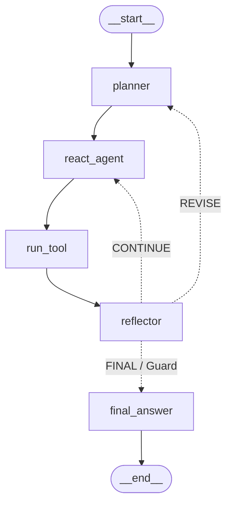

<p align="center">
  
</p>

<h1 align="center">ZenithDx: Patient-Centric Multi-Modal Agentic AI Clinical Workstation</h1>

<p align="center">
  <b>Diploma Thesis Architecture</b>: Multi-Modal Autonomous ReAct Decision Support System for Chest Radiography, Heterogeneous Graph EHR Traversal, ColBERT RAG, and Explainable Clinical Triage.
</p>

<p align="center">
  
  
  
  
  
  
</p>

---

## 📋 Table of Contents
1. [🌟 Executive Summary & Theoretical Innovations](#-executive-summary--theoretical-innovations)
2. [🧠 1. Cognitive Core & Agentic AI (LangGraph & Llama 3.2 3B SFT)](#-1-cognitive-core--agentic-ai-langgraph--llama-32-3b-sft)
3. [🫁 2. Computer Vision Pipeline (S²A-UNet & ResNet-50)](#-2-computer-vision-pipeline-s²a-unet--resnet-50)
4. [🕸️ 3. Longitudinal EHR Graph ML Pipeline (HGT & MIMIC-IV-ED)](#-3-longitudinal-ehr-graph-ml-pipeline-hgt--mimic-iv-ed)
5. [📚 4. Advanced RAG & SciBERT NLP Engine](#-4-advanced-rag--scibert-nlp-engine)
6. [🔍 5. Explainable AI Layers (XAI: Grad-CAM & PyTorch Captum)](#-5-explainable-ai-layers-xai-grad-cam--pytorch-captum)
7. [💻 6. Full-Stack Application Architecture (React, FastAPI, Postgres, Nginx)](#-6-full-stack-application-architecture-react-fastapi-postgres-nginx)
8. [🖼️ Application Screenshots & Live User Interfaces](#-application-screenshots--live-user-interfaces)
9. [📂 Project Directory Structure](#-project-directory-structure)
10. [🧪 Automated Testing & Verification Suite](#-automated-testing--verification-suite)
11. [🚀 Installation & Deployment Guide](#-installation--deployment-guide)

---

## 🌟 Executive Summary & Theoretical Innovations

**ZenithDx** is a state-of-the-art multi-modal clinical decision support workstation designed to bridge deep learning diagnostic models with human clinical reasoning. Grounded in a state-machine **LangGraph ReAct Autonomous Agent**, ZenithDx harmonizes multi-label chest radiography classification, longitudinal EHR history graph traversal, and peer-reviewed clinical RAG literature retrieval into transparent, explainable diagnostic summaries.

> [!IMPORTANT]
> **EU AI Act & GDPR Compliance**: Built with local GGUF inference via Ollama (`doctor2` / `llama3.2:3b`), ZenithDx ensures **zero data leakage**, zero external API call costs, and strict compliance with EU AI Act transparency and HIPAA privacy mandates.

---

## 🧠 1. Cognitive Core & Agentic AI (LangGraph & Llama 3.2 3B SFT)

The cognitive engine is designed to execute multi-step clinical workflows autonomously using the **ReAct (Reasoning + Acting)** paradigm with self-correction, state pruning, and proactive loop defense guards.

### LangGraph State Machine Architecture



### State Machine Node Roles & Control Flow
- **`planner`**: Evaluates input parameters (`input`, `image_path`, `patient_id`). Formulates a dynamic step-by-step plan:
  - Text-only queries: `["query_diag", "query_rag_web_enrichment", "consistency_check"]`
  - Multimodal X-ray queries: adds `["image_diag", "image_rag_web_enrichment"]`
  - Longitudinal patient ID queries: adds `["history_diag", "history_rag_web_enrichment"]`
- **`react_agent`**: Generates domain-tailored diagnostic prompts and executes reasoning iterations with the local `doctor2` LLM.
- **`run_tool`**: Wraps external pipeline execution (S²A-UNet segmentation, ResNet-50 ROI classification, FAISS SciBERT RAG, HGT Graph traversal).
- **`reflector`**: Performs **Self-Refine** critique. Evaluates diagnostic consistency across vision findings, symptoms, and EHR history. Decides whether to `CONTINUE` execution, `REVISE` the plan, or emit the `FINAL` diagnostic output.
- **`final_answer`**: Offloads PyTorch Captum Feature Ablation for text attributions, builds Grad-CAM heatmaps, formats the multi-label ResNet-50 predictions table, and constructs the structured clinical report.

### Infinite Loop Protection Guard & State Pruning
- **Loop Guard**: `should_continue_reflector` tracks `step_count`. If `step_count >= 7`, the graph forces an immediate transition to `final_answer`, eliminating infinite loops.
- **Context Pruning (`prune_state_context`)**: Truncates 1024-dim RAG passages and dense graph notes to keep prompt context compact (<4k tokens) and ensure sub-second inference speeds.

---

## 🫁 2. Computer Vision Pipeline (S²A-UNet & ResNet-50)

The vision pipeline processes chest radiographs (CXR) through a strict 4-stage pipeline combining deep spatial attention segmentation with masked ROI classification.

```
[Raw Chest Radiograph (H x W x 3)]
                │
                ▼
1. S²A-UNet Dual-Lobe Segmentation (`sa_unet_predict`)
   ├── Skip-Spatial Attention suppresses extrapulmonary tissue.
   └── Dice Coefficient = 0.9718 on test set.
                │
                ▼
2. Morphological Mask Refinement (`refine_unet_mask`)
   ├── Morphological Opening (cv2.MORPH_OPEN, 9x9 kernel): erodes ear spikes & noise.
   ├── Morphological Closing (cv2.MORPH_CLOSE): fills intra-pulmonary gaps.
   └── cv2.findContours filtering: retains strictly the 2 largest lung contours.
                │
                ▼
3. Segmented ROI Input Gating (`extract_segmented_roi`)
   ├── Element-wise multiplication: masked_input_image = original_image × mask_3d.
   ├── Safe bounding box crop with 8% padding (padding_percent=0.08).
   └── Resizes segmented ROI to 224x224x3 ImageNet normalized tensor.
                │
                ▼
4. ResNet-50 Multi-Label Classification (`resnet_predict`)
   ├── Evaluates 6 pathology logits on clean lung parenchyma (zero background noise).
   └── Optimal decision cutoffs via Youden's J [0.512, 0.496, 0.435, 0.471, 0.500, 0.514].
```

### Stage A: S²A-UNet Lung Segmentation & Morphological Cleaning
- **Skip-Spatial Attention (S²A-Block)**: Applied on skip connections to eliminate non-pulmonary background noise:
  $$	ext{attn\_map} = \sigma\left(	ext{Conv2D}_{3 	imes 3}\left([	ext{avg\_pool} \parallel 	ext{max\_pool}]
ight)
ight) \implies Y_{	ext{skip}} = X \odot 	ext{attn\_map}$$
- **Morphological Refinement (`refine_unet_mask`)**:
  1. Converts mask to uint8 `[0, 255]`.
  2. Applies Morphological Opening (`cv2.morphologyEx(..., cv2.MORPH_OPEN)` with a $9 	imes 9$ elliptical kernel) to erase sharp ear spikes and boundary artifacts.
  3. Applies Morphological Closing (`cv2.MORPH_CLOSE`) to fill intra-pulmonary holes.
  4. **Contour Filtering (`cv2.findContours`)**: Retains strictly the **2 largest connected components** (left and right lung fields), zeroing out isolated noise.

### Stage B: ResNet-50 ROI Masked Input Gating & Classification
- **Masked Input Gating**: ResNet-50 receives **only the segmented pulmonary parenchyma** ($	ext{masked\_input\_image} = 	ext{original\_image} \odot 	ext{mask\_3d}$), preventing the network from focusing on shoulder bones, ECG leads, or text labels ("L").
- **Bounding Box Crop**: Crops around lung field boundaries with an $8\%$ safe margin (`padding_percent=0.08`) to avoid clipping lung apices.
- **Youden's J Optimal Decision Thresholds**:
  | Pathology Finding | Decision Cutoff (Youden's J) | Metric |
  | :--- | :---: | :---: |
  | **Atelectasis** | **0.512** | **macro-AUROC: 0.78** |
  | **Consolidation** | **0.496** | *(Independent Test Set)* |
  | **Edema** | **0.435** | |
  | **Lung Lesion** | **0.471** | |
  | **Lung Opacity** | **0.500** | |
  | **Pneumonia** | **0.514** | |

---

## 🕸️ 3. Longitudinal EHR Graph ML Pipeline (HGT & MIMIC-IV-ED)

Models longitudinal clinical records from **MIMIC-IV-ED** (`edstays`, `diagnosis`, `triage`, `vitalsign`) as a heterogeneous knowledge graph $\mathcal{G} = (\mathcal{V}, \mathcal{E})$.

```
[Patient Node] ──(has_visit)──► [Visit #1] ──(has_diagnosis)──► [Diagnosis: ICD-10]
                                     │
                             (next_visit: Δt)
                                     ▼
                                [Visit #2] ──(has_vitalsign)──► [VitalSign: SpO2, BP]
```

### Architectural Subsystems
- **Sinusoidal Edge Temporal Encoding ($\Delta t$)**: Hour gaps between consecutive hospital visits are encoded via sinusoidal temporal embeddings:
  $$e_t = \sin(\omega \cdot \Delta t + \phi)$$
  This allows the model to understand recency (e.g. a visit 3 days ago carries higher weight than a visit 2 years ago).
- **Heterogeneous Graph Transformer (HGT)**: Metapath-aware multi-head attention over node and relation triplets (`Patient`, `Visit`, `Diagnosis`, `VitalSign`).
- **K-Means Phenotype Clustering**: Visit embeddings are clustered into **7 clinical phenotypes** (**Silhouette Index = 0.4707**), such as *Acute Respiratory & Pulmonary Opacity* or *Subacute Inflammatory & Pneumonia Risk*.

### How the History Graph Appears in the Doctor Report & Interactive Viewer (`LongitudinalGraphViewer.jsx`)

The PyVis & NetworkX interactive visualization transforms complex GNN mathematical embeddings into an intuitive, clinician-friendly chart:

1. **Temporal Flow Arrows (Purple Edges)**: Visualizes chronological progression ($\Delta t$) between hospital visits (e.g., `35 DAYS (Temporal Flow)`, `56 DAYS`). The physician immediately sees how quickly the patient's condition evolved.
2. **Phenotype Risk Badges (Blue Visit Nodes)**: Each visit node displays its assigned K-Means phenotype profile (e.g. `Visit #1: Low-Risk Outpatient`, `Visit #2: Acute Respiratory`, `Visit #3: Severe Cardiac/Hem`). The physician traces whether the patient is deteriorating over time.
3. **Diagnoses & Vitals (Red & Green Nodes)**:
   - **Red Nodes (ICD-9/10)**: Display primary diagnoses from each visit (e.g. `Dyspnea`, `Chest Pain`, `Pneumonia`).
   - **Green Nodes (VitalSigns)**: Display physiological parameters recorded during triage (`O2Sat=92%`, `HR=104 bpm`, `Temp=38.6°C`).

---

## 📚 4. Advanced RAG & SciBERT NLP Engine

Real-time clinical literature retrieval pipeline to enrich LLM context:
1. **RAG Defensive Gating**: Detects non-respiratory queries (e.g., migraine, photophobia) and bypasses RAG index lookup to prevent context bleed.
2. **SciBERT Preprocessing**: Cleans input text (lowercase, lemmatization, stopword removal) via SciBERT tokenizer.
3. **Hybrid Search (Early Fusion)**: Simultaneous dense FAISS vector search (`faiss_patient_index.bin`) and sparse BM25 keyword retrieval merged via score fusion.
4. **Late Interaction Re-ranking (ColBERT)**: Evaluates Top-N candidate documents using ColBERT token-to-token MaxSim inner products to select final LLM context passages.

---

## 🔍 5. Explainable AI Layers (XAI: Grad-CAM & PyTorch Captum)

### A. Visual Explainability (`create_segmented_gradcam`)
- Hooks placed on `layer4` of ResNet-50.
- **Blending & Lung Mask Gating**:
  1. Computes 60% original X-ray texture + 40% JET colormap overlay using `cv2.addWeighted(orig_float, 0.6, heat_float, 0.4, 0)`. This reveals the underlying pulmonary anatomy (ribs and parenchyma) semi-transparently under the Grad-CAM colors.
  2. Multiplies the blended overlay with `soft_mask_3d` to constrain heatmaps strictly inside lung boundaries on a **pure black background**.

### B. Textual Explainability (PyTorch Captum)
- **Feature Ablation**: Perturbation-based ablation systematically disables input tokens and measures output logit variance using the local `doctor2` PyTorch model checkpoint.
- **Visualizations**: Generates **Sequence Attribution bar charts** and **Token Importance Maps** displayed exclusively in the dedicated Captum XAI section.

---

## 💻 6. Full-Stack Application Architecture (React, FastAPI, Postgres, Nginx)

```
[Client Browser] ──(HTTP/HTTPS)──► [Nginx Reverse Proxy]
                                          │
                                          ▼
                             [FastAPI ASGI Web Server]
                                    │        │
                   ┌────────────────┘        └────────────────┐
                   ▼                                          ▼
        [PostgreSQL RDBMS]                           [Ollama Local LLM]
      (Users, Reports, JSONB)                        (doctor2 / llama3.2:3b)
```

- **Frontend (React 18 & Vite)**: Built with React, Vite bundler, Tailwind CSS, and Framer Motion animations.
- **Backend (FastAPI & Uvicorn)**: Asynchronous ASGI execution with Pydantic schemas.
- **Database (PostgreSQL RDBMS)**: Stores users and diagnostic reports with JSONB columns for XAI data.
- **Security (OAuth2 & JWT)**: Authentication via OAuth2 issuing time-limited JSON Web Tokens.

---

## 🖼️ Application Screenshots & Live User Interfaces

### 1. Landing Page (`LandingPage.jsx`)
*Crisp clinical landing page featuring Framer Motion hero animations, dynamic rotating AI analysis card, and role portal entry points.*


### 2. Clinician Decision Workstation (`HomeDoctor.jsx`)
*Hospital clinical triage queue featuring live status indicators, search filtering, and quick action approvals.*


### 3. Clinician Diagnostic Report View (`Reports.jsx`)
*Comprehensive multi-modal diagnostic report view featuring structured assessment, blended Grad-CAM heatmaps, S²A-UNet ROI segmentation, and PyTorch Captum text saliency plots.*


---

## 📂 Project Directory Structure

```
ZenithDx_Final/
├── docker-compose.yml                # Multi-container orchestration (FastAPI, Postgres, Ollama, Nginx)
├── README.md                         # Analytical platform documentation & theoretical specification
├── screenshots/                      # High-resolution application screenshots
│
├── frontend/                         # React 18 + Vite + Tailwind CSS User Workstation
│   ├── package.json                  # Node.js dependencies (React, Lucide, Tailwind, Framer Motion)
│   ├── vite.config.js                # Vite bundler & API proxy configuration
│   └── src/                          
│       ├── components/               # Reusable UI components
│       │   ├── Navbar.jsx            # Header navigation & user profile drawer
│       │   ├── XAIViewer.jsx         # Interactive Grad-CAM & Captum explainability viewer
│       │   └── LongitudinalGraphViewer.jsx # PyVis timeline EHR graph iframe container
│       └── pages/                    # Application pages
│           ├── HomeDoctor.jsx        # Clinician triage queue & decision workstation
│           ├── HomePatient.jsx       # Patient portal & submission tracking
│           ├── Reports.jsx           # Comprehensive multi-modal diagnostic report view
│           ├── Detect.jsx            # Interactive scan submission wizard
│           └── AuthPage.jsx          # Dual-role JWT authentication portal
│
└── backend/                          # FastAPI Backend & AI Orchestration Layer
    ├── main.py                       # FastAPI entry point, CORS middleware & exception handlers
    ├── config.py                     # System settings (Pydantic BaseSettings)
    ├── agentic_core/                 # LangGraph Agent & State Machine Engine
    │   ├── graph_state.py            # Custom state definition (StateGraph & message memory)
    │   ├── agent_loop.py             # ReAct reasoning loop, loop defenses & reflector node
    │   └── tools/                    # Autonomous agent execution tools
    │       ├── vision_tool.py        # Vision pipeline wrapper (S²A-UNet & ResNet-50)
    │       ├── rag_tool.py           # Hybrid search wrapper (FAISS + BM25 + ColBERT)
    │       └── ehr_tool.py           # EHR graph traversal wrapper (HGT model)
    ├── pipelines/                    # AI Model Execution Pipelines
    │   ├── vision/                   
    │   │   ├── s2a_unet.py           # S²A-UNet segmentation & refine_unet_mask morphological opening
    │   │   └── resnet50.py           # ResNet-50 multi-label classification backbone
    │   ├── nlp_rag/                  
    │   │   ├── hybrid_search.py      # Dense FAISS + Sparse BM25 score fusion engine
    │   │   └── reranker.py           # ColBERT late interaction re-ranking engine
    │   ├── graph_ehr/                
    │   │   ├── hgt_model.py          # Heterogeneous Graph Transformer (HGT) PyTorch model
    │   │   └── graph_visualizer.py   # PyVis / NetworkX LR timeline visualizer
    │   └── pdf_generator.py          # ReportLab PDF report generation engine
    └── xai/                          
        ├── visual_explainer.py       # ResNet-50 Layer4 Grad-CAM hooks, 60% X-ray texture blending
        └── text_explainer.py         # PyTorch Captum text token feature ablation
```

---

## 🧪 Automated Testing & Verification Suite

Execute the standalone testing suite to verify system health and pipeline contracts:

```powershell
# 1. Verify Vision Pipeline (S²A-UNet + ResNet-50 + Grad-CAM)
python backend/test_vision_pipeline.py

# 2. Verify Anatomical Dual-Lobe Lung Segmentation & Morphological Opening
python backend/test_sa_unet_quick.py

# 3. Verify PyVis / NetworkX EHR Timeline Graph Visualizer
python backend/test_graph_visualizer.py

# 4. Verify ReportLab PDF Generator Engine
python backend/test_pdf_export.py

# 5. Verify FastAPI Backend Server Health
python backend/test_server_health.py
```

---

## 🚀 Installation & Deployment Guide

### Prerequisites
- **Python**: 3.10+
- **Node.js**: 18+
- **PostgreSQL**: 14+
- **Ollama**: Running locally with `doctor2` / `llama3.2:3b` model installed

### 1. Backend Setup
```powershell
cd backend
python -m venv venv
.env\Scriptsctivate
pip install -r requirements.txt
python main.py
```
*Backend runs on `http://127.0.0.1:8000`.*

### 2. Frontend Setup
```powershell
cd frontend
npm install
npm run dev
```
*Frontend workstation runs on `http://localhost:5173`.*

---

### 📜 License & Citation
Developed as part of the Diploma Thesis on Advanced Agentic Multi-Modal AI Clinical Decision Support Workstations.
