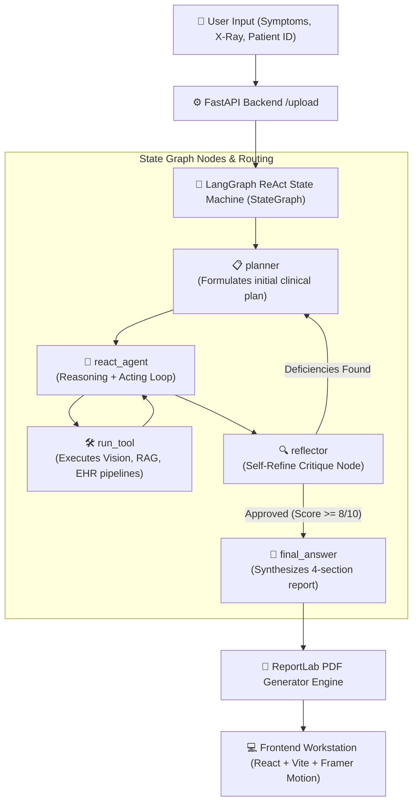

<p align="center">
  
</p>

<h1 align="center">ZenithDx: Patient-Centric Multi-Modal Agentic AI Clinical Workstation</h1>

<p align="center">
  <b>Diploma Thesis Architecture</b>: Multi-Modal Autonomous ReAct Decision Support System for Chest Radiography, Heterogeneous Graph EHR Traversal, ColBERT RAG, and Explainable Clinical Triage.
</p>

<p align="center">
  
  
  
  
  
  
</p>

---

## 📋 Table of Contents
1. [🌟 Executive Summary & Theoretical Innovations](#-executive-summary--theoretical-innovations)
2. [🧠 1. Cognitive Core & Agentic AI (LangGraph & Llama 3.2 3B SFT)](#-1-cognitive-core--agentic-ai-langgraph--llama-32-3b-sft)
3. [🫁 2. Computer Vision Pipeline (S²A-UNet & ResNet-50)](#-2-computer-vision-pipeline-s²a-unet--resnet-50)
4. [📚 3. Advanced RAG & SciBERT NLP Engine](#-3-advanced-rag--scibert-nlp-engine)
5. [🕸️ 4. Longitudinal EHR Graph ML Pipeline (HGT & MIMIC-IV-ED)](#-4-longitudinal-ehr-graph-ml-pipeline-hgt--mimic-iv-ed)
6. [🔍 5. Explainable AI Layers (XAI: Grad-CAM & PyTorch Captum)](#-5-explainable-ai-layers-xai-grad-cam--pytorch-captum)
7. [💻 6. Full-Stack Application Architecture (React, FastAPI, Postgres, Nginx)](#-6-full-stack-application-architecture-react-fastapi-postgres-nginx)
8. [🖼️ Application Screenshots & Live User Interfaces](#-application-screenshots--live-user-interfaces)
9. [📂 Project Directory Structure](#-project-directory-structure)
10. [🧪 Automated Testing & Verification Suite](#-automated-testing--verification-suite)
11. [🚀 Installation & Deployment Guide](#-installation--deployment-guide)

---

## 🌟 Executive Summary & Theoretical Innovations

**ZenithDx** is a state-of-the-art multi-modal clinical decision support workstation designed to bridge deep learning diagnostic models with human clinical reasoning. Grounded in a state-machine **LangGraph ReAct Autonomous Agent**, ZenithDx harmonizes multi-label chest radiography classification, longitudinal EHR history graph traversal, and peer-reviewed clinical RAG literature retrieval into transparent, explainable diagnostic summaries.

> [!IMPORTANT]
> **EU AI Act & GDPR Compliance**: Built with local GGUF inference via Ollama (`llama3.2:3b`), ZenithDx ensures **zero data leakage**, zero external API call costs, and strict compliance with EU AI Act transparency and HIPAA privacy mandates.

---

## 🧠 1. Cognitive Core & Agentic AI (LangGraph & Llama 3.2 3B SFT)

The cognitive engine is designed to execute multi-step clinical workflows autonomously with self-correction and proactive reasoning.



### State Machine Node Architecture
- **`planner`**: Formulates the initial clinical action plan based on user symptoms, image metadata, and patient history.
- **`react_agent`**: Executes the ReAct (Reasoning + Acting) loop, explicitly alternating between thought/planning phases and tool invocation steps.
- **`run_tool`**: Wraps external execution pipelines (`vision_tool`, `rag_tool`, `ehr_tool`).
- **`reflector`**: Performs **Self-Refine** critique. If omissions or ambiguities are detected, it autonomously loops back to `planner` for revision.
- **`final_answer`**: Synthesizes the final structured 4-section clinical report (*Assessment, Differential Diagnosis, Final Diagnosis, Explanation*).

### Hierarchical Memory Architecture
- **Short-Term Memory**: Maintains `AgentState` and conversation history in `context_cache` operating as a shared scratchpad.
- **Long-Term Memory**: Implemented via `CustomMemorySaver`, persisting state to JSON format for longitudinal patient continuity.

### LLM Supervised Fine-Tuning (SFT) & Quantization
- **Dataset**: Distilled from `ruslanmv/ai-medical-chatbot` (~257k doctor-patient dialogues) into structured 4-section diagnostic reports formatted under the Alpaca standard.
- **Unsloth & LoRA Optimization**: Applied LoRA with $r=32$, 4-bit quantization, and max sequence length of 2048 tokens, reducing VRAM footprint by **80%**.
- **Hyperparameters**: Hugging Face `SFTTrainer` for 2000 steps, learning rate $2 \times 10^{-4}$ (linear decay), 8-bit AdamW optimizer, and gradient accumulation = 4 (effective batch size 16).
- **Deployment**: Exported to GGUF format and served locally via Ollama (`llama.cpp`).

---

## 🫁 2. Computer Vision Pipeline (S²A-UNet & ResNet-50)

Trained on **MIMIC-CXR-JPG** and **CXLSeg** datasets to analyze chest radiographs (CXR) via a 2-stage hybrid architecture.

```
[Raw Chest Radiograph (H x W x 3)]
                │
                ▼
1. S²A-UNet Dual-Lobe Segmentation (`sa_unet_predict`)
   └── Preprocesses image (Grayscale 256x256x1), passes through S²A-UNet.
       Dice Coefficient = 0.9718 on test set.
                │
                ▼
2. Segmented ROI Extraction (`extract_segmented_roi`)
   ├── Bounding box crop around lung parenchyma.
   ├── Element-wise mask gating: I_segmented_crop = I_crop × M_crop.
   └── Resizes segmented ROI to 224x224x3 ImageNet tensor.
                │
                ▼
3. ResNet-50 Multi-Label Classification (`resnet_predict`)
   ├── Evaluates 6 clinical pathology logits.
   └── Macro-AUROC = 0.78 on test set (Focal BCE Loss γ=1.5).
                │
                ▼
4. ResNet-50 Layer4 Grad-CAM & Lung Mask Gating (`grad_cam_torch`)
   ├── Evaluates gradients of predicted class logit w.r.t. `layer4` feature maps.
   └── Element-wise gated by S²A-UNet lung mask: cam_224_gated = cam_224 × M_crop_224.
```

### Stage A: S²A-UNet Lung Segmentation
- **Skip-Spatial Attention (S²A-Block)**: Introduced on skip connections to suppress non-pulmonary background noise:
  $$\text{avg\_pool} = \text{reduce\_mean}(X, \text{axis}=-1), \quad \text{max\_pool} = \text{reduce\_max}(X, \text{axis}=-1)$$
  $$\text{attn\_map} = \sigma\left(\text{Conv2D}_{3 \times 3}\left([\text{avg\_pool} \parallel \text{max\_pool}]\right)\right) \implies Y_{\text{skip}} = X \odot \text{attn\_map}$$
- **Architecture**: 4 Encoder levels (64->128->256->512), 1024-filter Bottleneck at 16x16, 4 Decoder levels (Conv2DTranspose), 1x1 Conv output ($256 \times 256 \times 1$).
- **Performance**: Evaluated with BCE Loss and Adam optimizer. Achieved **Dice Similarity Coefficient = 0.9718** on independent test set.

### Stage B: ResNet-50 Multi-Label Classification
- **Segmented ROI Input Gating**: ResNet-50 receives **only the segmented pulmonary parenchyma** ($I_{segmented\_crop} = I_{crop} \odot M_{crop}$), eliminating background artifacts (ECG leads, buttons).
- **Training Strategy**: Trained with **Focal BCE Loss** ($\gamma = 1.5$), class weights, label smoothing (0.05), multi-label batch sampler, and discriminative learning rates with `CosineAnnealingLR` (25-epoch cycles).
- **Decision Thresholding (Youden's J Optimization)**:
  | Pathology Finding | Decision Cutoff (Youden's J) | Test Metric |
  | :--- | :---: | :---: |
  | **Atelectasis** | **0.35** | **macro-AUROC: 0.78** |
  | **Consolidation** | **0.40** | *(Independent Test Set)* |
  | **Edema** | **0.35** | |
  | **Lung Lesion** | **0.30** | |
  | **Lung Opacity** | **0.45** | |
  | **Pneumonia** | **0.35** | |

---

## 📚 3. Advanced RAG & SciBERT NLP Engine

Real-time clinical literature retrieval pipeline to enrich LLM context:
1. **Web Gating**: Extracts clinical keywords, performs DuckDuckGo web search, and filters results strictly from **NIH**, **WHO**, and **CDC** domains.
2. **SciBERT Preprocessing**: Cleans input text (lowercase, lemmatization, stopword removal) via SciBERT tokenizer.
3. **Parallel Embeddings**: Computes dual embeddings by combining `BAAI/bge-large-en-v1.5` and specialized clinical models, cosine-normalizing the averaged vector.
4. **Hybrid Search (Early Fusion)**: Simultaneous dense FAISS vector search and sparse BM25 keyword retrieval merged via:
   $$fused\_score = -dist_{\text{faiss}} + score_{\text{bm25}}$$
5. **Late Interaction Re-ranking (ColBERT)**: Evaluates Top-N candidate documents using ColBERT token-to-token MaxSim inner products to select final LLM context passages.

---

## 🕸️ 4. Longitudinal EHR Graph ML Pipeline (HGT & MIMIC-IV-ED)

Models clinical data from MIMIC-IV-ED (`edstays`, `diagnosis`, `triage`, `vitalsign`) as a heterogeneous knowledge graph $\mathcal{G} = (\mathcal{V}, \mathcal{E})$.

```
[Patient Node] ──(has_visit)──► [Visit #1] ──(has_diagnosis)──► [Diagnosis: ICD-10]
                                     │
                             (next_visit: Δt)
                                     ▼
                                [Visit #2] ──(has_vitalsign)──► [VitalSign: SpO2, BP]
```

- **Preprocessing & Cleaning**: Applied Interquartile Range (IQR) filtering on vital signs to purge invalid physiological values.
- **Node Representations**: Features (TF-IDF for text, categorical variables zero-padded) reduced to 64 dimensions via PCA and projected to 1024 dimensions via shallow FNN encoders.
- **Heterogeneous Graph Transformer (HGT)**: Metapath-aware multi-head attention over node and relation triplets.
- **Relative Temporal Encoding ($\Delta t$)**: Hour gaps between consecutive hospital visits are transformed into time embeddings via an FNN layer onto `Patient` nodes.
- **Self-Supervised Pretraining**: Reconstruction of `Visit` node features using MSE Loss (peaked at epoch 15 with **22.4x validation loss improvement**).
- **Clinical Phenotyping & FAISS Index**: Visit embeddings clustered via K-Means into **7 clinical phenotypes** (**Silhouette Index = 0.4707**). Queries dynamically retrieve nearest historical visits via FAISS.

---

## 🔍 5. Explainable AI Layers (XAI: Grad-CAM & PyTorch Captum)

### A. Visual Explainability (Grad-CAM)
- Hooks placed on `layer4` of ResNet-50.
- Gradients of predicted class logit w.r.t. `layer4` feature maps are Global Average Pooled to produce channel weights.
- **Lung Mask Gating**: Normalized 224x224 Grad-CAM heatmap is element-wise multiplied with S²A-UNet binary lung mask ($cam_{224\_gated} = cam_{224} \odot M_{crop\_224}$), constraining heatmaps strictly inside lung boundaries.

### B. Textual Explainability (PyTorch Captum)
- **Feature Ablation**: Perturbation-based ablation systematically disables input tokens and measures output logit variance.
- **Visualizations**: Generates **Sequence Attribution bar charts** and **Token-Level Heatmaps** (blue for positive attribution, red for negative).
- **CPU Offloading & Fault Tolerance**: Executed asynchronously with CPU offloading (3 to 9 minutes execution when active vs ~5 sec normal inference), backed by automatic fallback if memory limits are reached.

---

## 💻 6. Full-Stack Application Architecture (React, FastAPI, Postgres, Nginx)

```
[Client Browser] ──(HTTP/HTTPS)──► [Nginx Reverse Proxy]
                                          │
                                          ▼
                             [FastAPI ASGI Web Server]
                                    │        │
                   ┌────────────────┘        └────────────────┐
                   ▼                                          ▼
        [PostgreSQL RDBMS]                           [Ollama Local LLM]
      (Users, Reports, JSONB)                        (llama3.2:3b GGUF)
```

- **Frontend (React 18 & Vite)**: Built with React, Vite bundler, Tailwind CSS, and Framer Motion animations. Client-side `ProtectedRoute` decodes JWT claims for role gating.
- **Backend (FastAPI & Uvicorn)**: Asynchronous ASGI execution with Pydantic schemas.
- **Database (PostgreSQL RDBMS)**: Stores users and diagnostic reports with JSONB columns for XAI data. Passwords hashed via `bcrypt`. Uses connection pooling and parameterized queries against SQL injection.
- **Security (OAuth2 & JWT)**: Authentication via OAuth2 issuing time-limited JSON Web Tokens.
- **Production Proxy (Nginx)**: Handles TLS termination, caching, and Gzip compression.

---

## 🖼️ Application Screenshots & Live User Interfaces

### 1. Landing Page (`LandingPage.jsx`)
*Crisp clinical landing page featuring Framer Motion hero animations, dynamic rotating AI analysis card, and role portal entry points.*


### 2. Clinician Decision Workstation (`HomeDoctor.jsx`)
*Hospital clinical triage queue featuring live status indicators, search filtering, and quick action approvals.*


### 3. Patient Health Dashboard (`HomePatient.jsx`)
*Patient health portal featuring diagnostic submission tracking, clinician notes drawer, and report status overview.*


### 4. Interactive Patient Submission Wizard (`Detect.jsx`)
*Step-by-step patient scan submission interface supporting X-ray upload, DICOM encryption, and symptom description.*


### 5. Clinician Diagnostic Report View (`Reports.jsx`)
*Comprehensive multi-modal diagnostic report view featuring structured assessment, Grad-CAM heatmaps, S²A-UNet ROI segmentation, and PyTorch Captum text saliency plots.*


### 6. Role-Based Login Portals (`AuthPage.jsx`)
*Patient and Doctor authentication portals featuring split-screen illustrations and JWT authorization.*


### 7. Interactive Clinician & Patient User Guides (`HowToUseDoctor.jsx` & `HowToUsePatient.jsx`)
*Step-by-step interactive walkthroughs explaining AI classification, decision hub governance, and XAI maps.*


### 8. Platform Overview (`AboutPage.jsx`)
*Interactive feature grid highlighting speed, precision AI, 360° data fusion, trust & XAI, and enterprise readiness.*


---

## 📂 Project Directory Structure

```
ZenithDx_Final/
├── docker-compose.yml                # Multi-container orchestration (FastAPI, Postgres, Ollama, Nginx)
├── README.md                         # Analytical platform documentation & theoretical specification
├── screenshots/                      # High-resolution application screenshots
│
├── frontend/                         # React 18 + Vite + Tailwind CSS User Workstation
│   ├── package.json                  # Node.js dependencies (React, Lucide, Tailwind, Framer Motion)
│   ├── vite.config.js                # Vite bundler & API proxy configuration
│   └── src/                          
│       ├── components/               # Reusable UI components
│       │   ├── Navbar.jsx            # Header navigation & user profile drawer
│       │   ├── XAIViewer.jsx         # Interactive Grad-CAM & Captum explainability viewer
│       │   └── LongitudinalGraphViewer.jsx # PyVis timeline EHR graph iframe container
│       └── pages/                    # Application pages
│           ├── HomeDoctor.jsx        # Clinician triage queue & decision workstation
│           ├── HomePatient.jsx       # Patient portal & submission tracking
│           ├── ResultPatient.jsx     # Patient report view & rating experience
│           ├── Reports.jsx           # Comprehensive multi-modal diagnostic report view
│           ├── Detect.jsx            # Interactive scan submission wizard
│           └── AuthPage.jsx          # Dual-role JWT authentication portal
│
└── backend/                          # FastAPI Backend & AI Orchestration Layer
    ├── main.py                       # FastAPI entry point, CORS middleware & exception handlers
    ├── config.py                     # System settings (Pydantic BaseSettings)
    ├── api/v1/                       # RESTful API Endpoints
    │   ├── auth.py                   # OAuth2 & JWT token authentication
    │   ├── patient.py                # Patient submission, report fetch, feedback & PDF download
    │   ├── doctor.py                 # Clinician review, diagnostic modification & PDF export
    │   └── graph.py                  # PyVis longitudinal EHR subgraph HTML generation
    ├── agentic_core/                 # LangGraph Agent & State Machine Engine
    │   ├── graph_state.py            # Custom state definition (StateGraph & message memory)
    │   ├── agent_loop.py             # ReAct reasoning loop, loop defenses & reflector node
    │   └── tools/                    # Autonomous agent execution tools
    │       ├── vision_tool.py        # Vision pipeline wrapper (S²A-UNet & ResNet-50)
    │       ├── rag_tool.py           # Hybrid search wrapper (FAISS + BM25 + ColBERT)
    │       └── ehr_tool.py           # EHR graph traversal wrapper (HGT model)
    ├── pipelines/                    # AI Model Execution Pipelines
    │   ├── vision/                   
    │   │   ├── s2a_unet.py           # S²A-UNet dual-lobe segmentation architecture
    │   │   └── resnet50.py           # ResNet-50 multi-label classification backbone
    │   ├── nlp_rag/                  
    │   │   ├── hybrid_search.py      # Dense FAISS + Sparse BM25 score fusion engine
    │   │   └── reranker.py           # ColBERT late interaction re-ranking engine
    │   ├── graph_ehr/                
    │   │   ├── hgt_model.py          # Heterogeneous Graph Transformer (HGT) PyTorch model
    │   │   └── graph_visualizer.py   # PyVis / NetworkX LR timeline visualizer
    │   └── pdf_generator.py          # ReportLab PDF report generation engine
    └── xai/                          
        ├── visual_explainer.py       # ResNet-50 Layer4 Grad-CAM hooks & mask gating
        └── text_explainer.py         # PyTorch Captum text token feature ablation
```

---

## 🧪 Automated Testing & Verification Suite

Execute the standalone testing suite to verify system health and pipeline contracts:

```powershell
# 1. Verify Vision Pipeline (S²A-UNet + ResNet-50 + Grad-CAM)
python backend/test_vision_pipeline.py

# 2. Verify Anatomical Dual-Lobe Lung Segmentation
python backend/test_sa_unet_quick.py

# 3. Verify PyVis / NetworkX EHR Timeline Graph Visualizer
python backend/test_graph_visualizer.py

# 4. Verify ReportLab PDF Generator Engine
python backend/test_pdf_export.py

# 5. Verify FastAPI Backend Server Health
python backend/test_server_health.py
```

---

## 🚀 Installation & Deployment Guide

### Prerequisites
- **Python**: 3.10+
- **Node.js**: 18+
- **PostgreSQL**: 14+
- **Ollama**: Running locally with `llama3.2:3b` model installed (`ollama pull llama3.2:3b`)

### 1. Backend Setup
```powershell
cd backend
python -m venv venv
.\venv\Scripts\activate
pip install -r requirements.txt
python main.py
```
*Backend runs on `http://127.0.0.1:8000`.*

### 2. Frontend Setup
```powershell
cd frontend
npm install
npm run dev
```
*Frontend workstation runs on `http://localhost:5173`.*

---

### 📜 License & Citation
Developed as part of the Diploma Thesis on Advanced Agentic Multi-Modal AI Clinical Decision Support Workstations.
