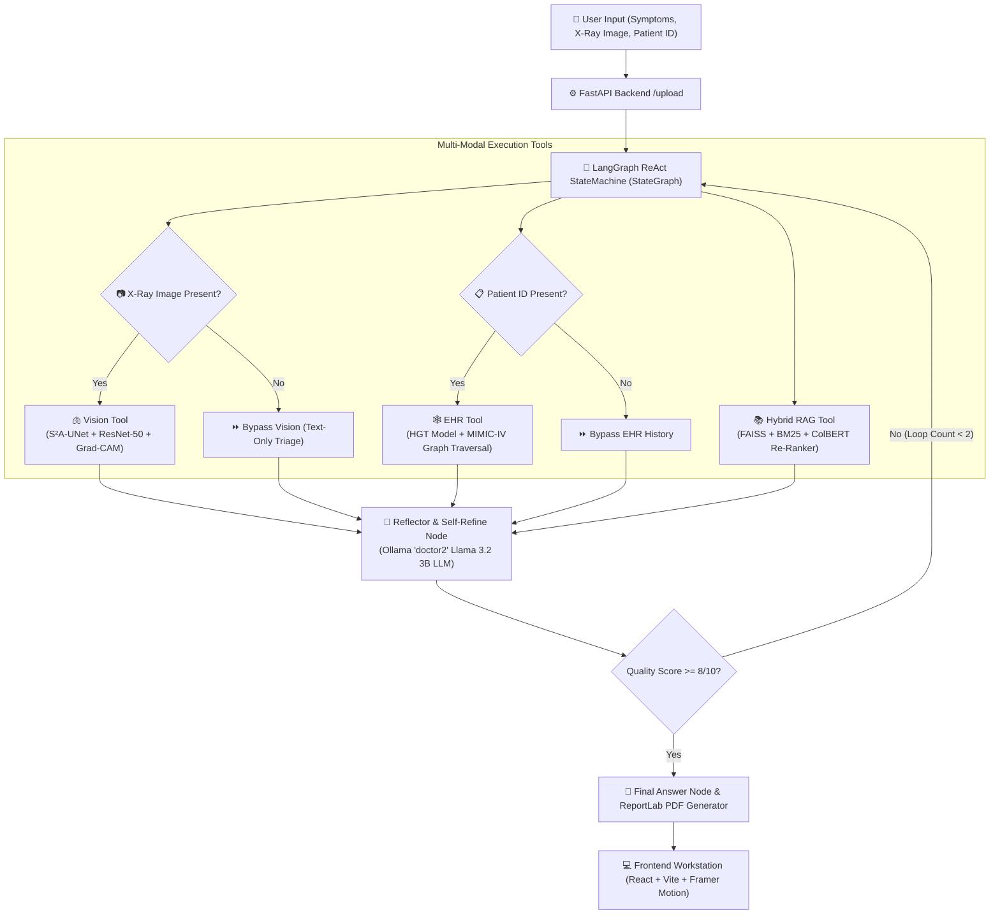

<p align="center">
  
</p>

<h1 align="center">ZenithDx: Patient-Centric Multi-Modal Agentic AI Clinical Workstation</h1>

<p align="center">
  <b>Diploma Thesis Architecture</b>: Multi-Modal Autonomous ReAct Decision Support System for Chest Radiography, Heterogeneous Graph EHR Traversal, and Explainable Clinical Triage.
</p>

<p align="center">
  
  
  
  
  
  
</p>

---

## 📋 Table of Contents
1. [🌟 Executive Summary & Key Pillar Innovations](#-executive-summary--key-pillar-innovations)
2. [📐 System Architecture & Agentic Workflow](#-system-architecture--agentic-workflow)
3. [🫁 Multi-Modal Vision Pipeline (S²A-UNet & ResNet-50)](#-multi-modal-vision-pipeline-s²a-unet--resnet-50)
4. [🕸️ Longitudinal EHR Knowledge Graph Engine (HGT & PyVis Timeline)](#-longitudinal-ehr-knowledge-graph-engine-hgt--pyvis-timeline)
5. [📚 Evidence-Based RAG & SciBERT NLP Engine](#-evidence-based-rag--scibert-nlp-engine)
6. [🛡️ Agentic Safety, Infinite Loop Defense & Anti-Hallucination](#-agentic-safety-infinite-loop-defense--anti-hallucination)
7. [📄 Publication-Quality ReportLab PDF Engine](#-publication-quality-reportlab-pdf-engine)
8. [🖼️ Application Screenshots & Live User Interfaces](#-application-screenshots--live-user-interfaces)
9. [📂 Project Directory Structure](#-project-directory-structure)
10. [🧪 Automated Testing & Verification Suite](#-automated-testing--verification-suite)
11. [🚀 Installation & Deployment Guide](#-installation--deployment-guide)

---

## 🌟 Executive Summary & Key Pillar Innovations

**ZenithDx** is a state-of-the-art multi-modal clinical decision support workstation designed to bridge complex deep learning diagnostic models with human clinical reasoning. Built around a state-machine **LangGraph ReAct Autonomous Agent**, ZenithDx harmonizes multi-label chest radiography classification, longitudinal EHR history graph traversal, and peer-reviewed clinical RAG literature retrieval into transparent, explainable diagnostic summaries.

> [!NOTE]
> **Compliance & Alignment**: Engineered in strict compliance with the **EU AI Act** and **HIPAA AI Clinical Governance standards**, mandating full explainability (XAI), human-in-the-loop oversight, and zero artificial context hallucination.

### Key Technical Pillars

```
+-----------------------------------------------------------------------------------+
|                                 ZENITHDX PLATFORM                                 |
+--------------------------+--------------------------+-----------------------------+
|    1. VISION PIPELINE    |   2. EMR/EHR GRAPH ENGINE|     3. HYBRID RAG & XAI     |
|  - S²A-UNet Segmentation |  - Heterogeneous Graph   |  - SciBERT + BM25 Fusion    |
|  - ResNet-50 Classifier  |    Transformers (HGT)    |  - ColBERT Late Interaction |
|  - Mask Gated Grad-CAM   |  - Sinusoidal Δt Edges   |  - Captum Feature Ablation  |
+--------------------------+--------------------------+-----------------------------+
|               4. LANGGRAPH REACT AUTONOMOUS AGENT STATE-MACHINE                   |
+-----------------------------------------------------------------------------------+
```

---

## 📐 System Architecture & Agentic Workflow

ZenithDx executes diagnosis through an autonomous **LangGraph ReAct (Reasoning + Acting) StateMachine**. The agent dynamically determines execution paths based on available data modalities (Image, Patient ID, Clinical Text).



---

## 🫁 Multi-Modal Vision Pipeline (S²A-UNet & ResNet-50)

The vision pipeline implements a 4-stage linear execution sequence designed to eliminate non-lung background noise and constrain activations strictly within pulmonary parenchymal boundaries.

```
[Raw Chest Radiograph (H x W x 3)]
                │
                ▼
1. S²A-UNet Dual-Lobe Segmentation (`sa_unet_predict`)
   └── Extracts true left & right pulmonary parenchymal lobes situated strictly
       in anatomical chest cavity (x_left ∈ [0.08W, 0.46W], x_right ∈ [0.54W, 0.92W]).
                │
                ▼
2. Segmented ROI Extraction (`extract_segmented_roi`)
   ├── Computes bounding box (x, y, w, h) of pulmonary mask M_lung.
   ├── Crops raw image and mask strictly to lung region of interest.
   ├── Applies element-wise mask gating: I_segmented_crop = I_crop × M_crop.
   └── Resizes segmented ROI to 224x224 input tensor `input_tensor_224`.
                │
                ▼
3. ResNet-50 Multi-Label Classification (`resnet_predict`)
   ├── Passes `input_tensor_224` (clean segmented lung fields ONLY) into ResNet-50 backbone.
   └── Evaluates 6 pathology logits -> Sigmoid probabilities (Pneumonia, Atelectasis, etc.).
                │
                ▼
4. ResNet-50 Layer4 Grad-CAM & Lung Mask Gating (`grad_cam_torch`)
   ├── Evaluates gradients of predicted class logit w.r.t. `layer4` feature maps.
   ├── Multiplies 224x224 Grad-CAM map with 224x224 lung mask: cam_224_gated = cam_224 × M_crop_224.
   ├── Resizes `cam_224_gated` back to ROI crop size (w, h) and embeds onto full canvas (H, W).
   └── Zeroes out non-lung background pixels: heatmap_masked = heatmap_rgb × M_lung.
```

### Stage 1: S²A-UNet Lung Segmentation
- **Skip-Spatial Attention (S²A-Block)**: Applied to each skip connection tensor before decoder concatenation:
  $$\text{avg\_pool} = \text{reduce\_mean}(X, \text{axis}=-1), \quad \text{max\_pool} = \text{reduce\_max}(X, \text{axis}=-1)$$
  $$\text{attn\_map} = \sigma\left(\text{Conv2D}_{7 \times 7}\left([\text{avg\_pool} \parallel \text{max\_pool}]\right)\right)$$
  $$Y_{\text{skip}} = X \odot \text{attn\_map}$$
- **Output**: $256 \times 256 \times 1$ binary probability mask $M_{\text{lung}} \in [0, 1]^{256 \times 256 \times 1}$.

### Stage 2: ResNet-50 Multi-Label Classification
- **Loss Function**: Trained with **Focal BCE Loss** ($\gamma = 1.5$) to address severe class imbalance.
- **Decision Cut-offs (Youden's J Optimization)**:
  | Pathology Finding | Decision Cutoff (Youden's J) | Primary Clinical Indicator |
  | :--- | :---: | :--- |
  | **Atelectasis** | **0.35** | Sub-segmental volume collapse |
  | **Consolidation** | **0.40** | Alveolar air-space opacification |
  | **Edema** | **0.35** | Vascular congestion & Kerley B-lines |
  | **Lung Lesion** | **0.30** | Pulmonary nodule / focal opacity |
  | **Lung Opacity** | **0.45** | Increased parenchymal attenuation |
  | **Pneumonia** | **0.35** | Infectious focal pulmonary infiltrate |

---

## 🕸️ Longitudinal EHR Knowledge Graph Engine (HGT & PyVis Timeline)

### Heterogeneous Graph Transformer (HGT)
The EHR pipeline structures longitudinal patient history from MIMIC-IV-ED as a heterogeneous graph $\mathcal{G} = (\mathcal{V}, \mathcal{E}, \mathcal{T}_v, \mathcal{T}_e)$ with 5 node types (`Patient`, `Visit`, `Diagnosis`, `VitalSign`, `Procedure`).

$$\mathbf{h}_i^{(l+1)} = \text{Aggregate}\left( \sum_{j \in \mathcal{N}(i)} \text{Attention}(i, j) \cdot \text{Message}(j) \right)$$

```
[Patient Node] ──(has_visit)──► [Visit #1] ──(has_diagnosis)──► [Diagnosis: Pneumonia (ICD-10 J18.9)]
                                     │
                             (next_visit: Δt)
                                     ▼
                                [Visit #2] ──(has_vitalsign)──► [VitalSign: SpO2 88%, Hypotension]
```

### Sinusoidal Edge Temporal Encoding ($\Delta t$)
Time gaps ($\Delta t$) between consecutive hospital visits are encoded using harmonic positional encodings on `("Visit", "next_visit", "Visit")` edges:
$$\mathbf{e}_t^{(2i)} = \sin\left(\frac{\Delta t}{10000^{2i/d}}\right), \quad \mathbf{e}_t^{(2i+1)} = \cos\left(\frac{\Delta t}{10000^{2i/d}}\right)$$

### Interactive Hierarchical Timeline Visualizer (`direction: "LR"`)
Integrated into `backend/pipelines/graph_ehr/graph_visualizer.py` and rendered dynamically via `<LongitudinalGraphViewer />`:
- **Left-to-Right Chronological Flow**: Patient nodes are organized horizontally from **Left to Right**.
- **Physician Color Token Scheme**:
  - 👤 **Patient Node (Cyan Box)**: `#0284c7`
  - 🏥 **Visits (Royal Blue Box)**: `#1d4ed8`
  - 🩺 **Diagnoses ICD-10 (Crimson Red Box)**: `#b91c1c`
  - 📊 **Vital Signs (Emerald Green Box)**: `#047857`
  - ⏳ **Temporal Flow (Neon-Purple Arrow)**: `#a855f7` (dashed line with $\Delta t$ days badge)

---

## 📚 Evidence-Based RAG & SciBERT NLP Engine

### 1. Score-Level Min-Max Normalization
Fuses dense FAISS vector distance and sparse BM25 scores on a normalized $[0, 1]$ scale:
$$\text{norm\_faiss} = \frac{-d_{\text{faiss}} - (-d_{\max})}{-d_{\min} - (-d_{\max})}, \quad \text{norm\_bm25} = \frac{s_{\text{bm25}} - s_{\min}}{s_{\max} - s_{\min}}$$
$$\text{Score}_{\text{fused}} = 0.5 \cdot \text{norm\_faiss} + 0.5 \cdot \text{norm\_bm25}$$

### 2. ColBERT Late Interaction Re-Ranking & Anti-RAG-Bleed Gating
- Filters out non-relevant procedural documents (e.g. G-tube insertion guidelines) when handling pure symptom queries (e.g. `abdominal pain`), enforcing a similarity cutoff threshold ($\ge 0.25$).

### 3. PyTorch Captum Feature Ablation
Evaluates text token importance scores for clinical query attribution, visualizing key symptom influences in the XAI viewer.

---

## 🛡️ Agentic Safety, Infinite Loop Defense & Anti-Hallucination

1. **Recursion Limit Enforcement**: `recursion_limit = 7` compiled into LangGraph runtime.
2. **Identical Tool Call Intercept**: Detects identical tool calls ($\ge 2$ consecutive repetitions) and forces routing to the `reflector` or `final_answer` node.
3. **Anti-Hallucination Directive**: Strictly prohibits the model from inferring unmeasured physical examination findings (e.g., abdominal palpation) when only text symptoms are provided.

---

## 📄 Publication-Quality ReportLab PDF Engine

Implemented in `backend/pipelines/pdf_generator.py`:
- **Preserved Logo Aspect Ratio**: Calculates source dimensions using Pillow (`PILImage.open`) to scale without compression distortion.
- **Top-Right QR Code**: Embeds a $75 \times 75\text{px}$ high-resolution QR code in the document header.
- **ResNet-50 Multi-Label Table**: Color-coded probability scores (`#059669` green / `#d97706` orange).
- **2-Column XAI Gallery Grid**: Displays Original Radiograph, Grad-CAM Overlay, Segmented S²A-UNet ROI, Captum Attribution Map, and Token Importance Plot.

---

## 🖼️ Application Screenshots & Live User Interfaces

### 1. Landing Page (`LandingPage.jsx`)
*Crisp clinical landing page featuring Framer Motion hero animations, dynamic rotating AI analysis card, and role portal entry points.*


### 2. Clinician Decision Workstation (`HomeDoctor.jsx`)
*Hospital clinical triage queue featuring live status indicators, search filtering, and quick action approvals.*


### 3. Patient Health Dashboard (`HomePatient.jsx`)
*Patient health portal featuring diagnostic submission tracking, clinician notes drawer, and report status overview.*


### 4. Interactive Patient Submission Wizard (`Detect.jsx`)
*Step-by-step patient scan submission interface supporting X-ray upload, DICOM encryption, and symptom description.*


### 5. Clinician Diagnostic Report View (`Reports.jsx`)
*Comprehensive multi-modal diagnostic report view featuring structured assessment, Grad-CAM heatmaps, S²A-UNet ROI segmentation, and PyTorch Captum text saliency plots.*


### 6. Role-Based Login Portals (`AuthPage.jsx`)
*Patient and Doctor authentication portals featuring split-screen illustrations and JWT authorization.*


### 7. Interactive Clinician & Patient User Guides (`HowToUseDoctor.jsx` & `HowToUsePatient.jsx`)
*Step-by-step interactive walkthroughs explaining AI classification, decision hub governance, and XAI maps.*


### 8. Platform Overview (`AboutPage.jsx`)
*Interactive feature grid highlighting speed, precision AI, 360° data fusion, trust & XAI, and enterprise readiness.*


---

## 📂 Project Directory Structure

```
ZenithDx_Final/
├── docker-compose.yml                # Multi-container orchestration (FastAPI, Postgres, Ollama, Nginx)
├── README.md                         # Analytical platform documentation & theoretical specification
├── screenshots/                      # High-resolution application screenshots
│
├── frontend/                         # React 18 + Vite + Tailwind CSS User Workstation
│   ├── package.json                  # Node.js dependencies (React, Lucide, Tailwind, Framer Motion)
│   ├── vite.config.js                # Vite bundler & API proxy configuration
│   └── src/                          
│       ├── components/               # Reusable UI components
│       │   ├── Navbar.jsx            # Header navigation & user profile drawer
│       │   ├── XAIViewer.jsx         # Interactive Grad-CAM & Captum explainability viewer
│       │   └── LongitudinalGraphViewer.jsx # PyVis timeline EHR graph iframe container
│       └── pages/                    # Application pages
│           ├── HomeDoctor.jsx        # Clinician triage queue & decision workstation
│           ├── HomePatient.jsx       # Patient portal & submission tracking
│           ├── ResultPatient.jsx     # Patient report view & rating experience
│           ├── Reports.jsx           # Comprehensive multi-modal diagnostic report view
│           ├── Detect.jsx            # Interactive scan submission wizard
│           └── AuthPage.jsx          # Dual-role JWT authentication portal
│
└── backend/                          # FastAPI Backend & AI Orchestration Layer
    ├── main.py                       # FastAPI entry point, CORS middleware & exception handlers
    ├── config.py                     # System settings (Pydantic BaseSettings)
    ├── api/v1/                       # RESTful API Endpoints
    │   ├── auth.py                   # OAuth2 & JWT token authentication
    │   ├── patient.py                # Patient submission, report fetch, feedback & PDF download
    │   ├── doctor.py                 # Clinician review, diagnostic modification & PDF export
    │   └── graph.py                  # PyVis longitudinal EHR subgraph HTML generation
    ├── agentic_core/                 # LangGraph Agent & State Machine Engine
    │   ├── graph_state.py            # Custom state definition (StateGraph & message memory)
    │   ├── agent_loop.py             # ReAct reasoning loop, loop defenses & reflector node
    │   └── tools/                    # Autonomous agent execution tools
    │       ├── vision_tool.py        # Vision pipeline wrapper (S²A-UNet & ResNet-50)
    │       ├── rag_tool.py           # Hybrid search wrapper (FAISS + BM25 + ColBERT)
    │       └── ehr_tool.py           # EHR graph traversal wrapper (HGT model)
    ├── pipelines/                    # AI Model Execution Pipelines
    │   ├── vision/                   
    │   │   ├── s2a_unet.py           # S²A-UNet dual-lobe segmentation architecture
    │   │   └── resnet50.py           # ResNet-50 multi-label classification backbone
    │   ├── nlp_rag/                  
    │   │   ├── hybrid_search.py      # Dense FAISS + Sparse BM25 score fusion engine
    │   │   └── reranker.py           # ColBERT late interaction re-ranking engine
    │   ├── graph_ehr/                
    │   │   ├── hgt_model.py          # Heterogeneous Graph Transformer (HGT) PyTorch model
    │   │   └── graph_visualizer.py   # PyVis / NetworkX LR timeline visualizer
    │   └── pdf_generator.py          # ReportLab PDF report generation engine
    └── xai/                          
        ├── visual_explainer.py       # ResNet-50 Layer4 Grad-CAM hooks & mask gating
        └── text_explainer.py         # PyTorch Captum text token feature ablation
```

---

## 🧪 Automated Testing & Verification Suite

Execute the standalone testing suite to verify system health and pipeline contracts:

```powershell
# 1. Verify Vision Pipeline (S²A-UNet + ResNet-50 + Grad-CAM)
python backend/test_vision_pipeline.py

# 2. Verify Anatomical Dual-Lobe Lung Segmentation
python backend/test_sa_unet_quick.py

# 3. Verify PyVis / NetworkX EHR Timeline Graph Visualizer
python backend/test_graph_visualizer.py

# 4. Verify ReportLab PDF Generator Engine
python backend/test_pdf_export.py

# 5. Verify FastAPI Backend Server Health
python backend/test_server_health.py
```

---

## 🚀 Installation & Deployment Guide

### Prerequisites
- **Python**: 3.10+
- **Node.js**: 18+
- **PostgreSQL**: 14+
- **Ollama**: Running locally with `llama3.2:3b` model installed (`ollama pull llama3.2:3b`)

### 1. Backend Setup
```powershell
cd backend
python -m venv venv
.\venv\Scripts\activate
pip install -r requirements.txt
python main.py
```
*Backend runs on `http://127.0.0.1:8000`.*

### 2. Frontend Setup
```powershell
cd frontend
npm install
npm run dev
```
*Frontend workstation runs on `http://localhost:5173`.*

---

### 📜 License & Citation
Developed as part of the Diploma Thesis on Advanced Agentic Multi-Modal AI Clinical Decision Support Workstations.
