<p align="center">
  
</p>

# ZenithDx: Patient-Centric Multi-Modal Agentic AI Clinical Workstation

> **Diploma Thesis**: *Autonomous ReAct Agent Orchestration, Heterogeneous Graph EHR Transformers (HGT), S²A-UNet Anatomical Segmentation, ResNet-50 Multi-Label Pathology Classification, ColBERT Hybrid RAG, PyTorch Captum Feature Ablation & Publication-Quality PDF Report Engine.*

---

## 🌟 Executive Summary & System Innovations

**ZenithDx** is a state-of-the-art multi-modal clinical decision support system designed to harmonize deep learning diagnostic models with human clinical reasoning. Built on a state-machine **LangGraph ReAct Autonomous Agent**, ZenithDx integrates multi-label chest radiography classification, longitudinal EHR history graph traversal, and peer-reviewed clinical RAG literature retrieval into transparent, explainable diagnostic summaries.

### Key Innovations & Technical Achievements
- **🤖 Autonomous State-Machine ReAct Orchestration**: LangGraph agent dynamically plans, invokes execution tools, performs self-refinement loops, and enforces strict recursion limits and anti-loop safety defenses.
- **🫁 Deep Vision & Spatial Explainability (XAI)**:
  - **Stage 1**: Dual-stage Skip-Spatial Attention U-Net (**S²A-UNet**) for anatomical left/right pulmonary lobe segmentation ($256 \times 256 \times 1$).
  - **Stage 2**: Crop & Mask Gating ($I_{segmented} = I_{crop} \odot M_{crop}$) feeding clean segmented pulmonary parenchyma into ResNet-50.
  - **Stage 3**: ResNet-50 multi-label classification trained with Focal BCE Loss and Youden's J optimal decision cutoffs.
  - **Stage 4**: ResNet-50 Layer4 **Grad-CAM** visual attention maps with multi-level lung mask gating.
- **🕸️ Longitudinal EHR Knowledge Graph Engine**:
  - **SciBERT 768-dim Dense Semantic Embeddings**: Rich medical concept representations.
  - **Multimodal Fusion MLP**: Non-linear projection head $\mathbf{q} = \text{MLP}(\mathbf{v}_{symp} \oplus \mathbf{v}_{img})$ mapping text and vision logits.
  - **Sinusoidal Edge Temporal Encoding**: Harmonic positional encoding $\mathbf{e}_t^{(i)} = \sin(\omega_i \Delta t + \phi_i)$ on `("Visit", "next_visit", "Visit")` relations.
  - **Graph Contrastive Learning (InfoNCE)**: Supervised intra-patient/intra-phenotype visit alignment.
  - **Hierarchical Timeline Layout**: Interactive PyVis visualizer organizing patient history in a Left-to-Right timeline (`direction: "LR"`) with glowing neon-purple temporal flow arrows (`──Δt──►`).
- **📚 Evidence-Based Hybrid RAG & Text Saliency**:
  - **Min-Max Score Normalization**: Fuses dense FAISS Euclidean distance and sparse BM25 scores on a normalized $[0, 1]$ scale.
  - **ColBERT Re-Ranking & Anti-RAG-Bleed Gating**: Filters out irrelevant procedural device insertions (e.g. G-tubes) for pure symptom queries.
  - **PyTorch Captum Feature Ablation**: Token importance scoring for text explainability.
- **📄 Publication-Quality ReportLab PDF Engine**:
  - Logo aspect ratio preservation (zero distortion).
  - Prominent Top-Right QR Code.
  - ResNet-50 pathology prediction scores table.
  - 2-column radiograph & XAI explainability image gallery.

---

## 📐 System Architecture & Agentic Workflow

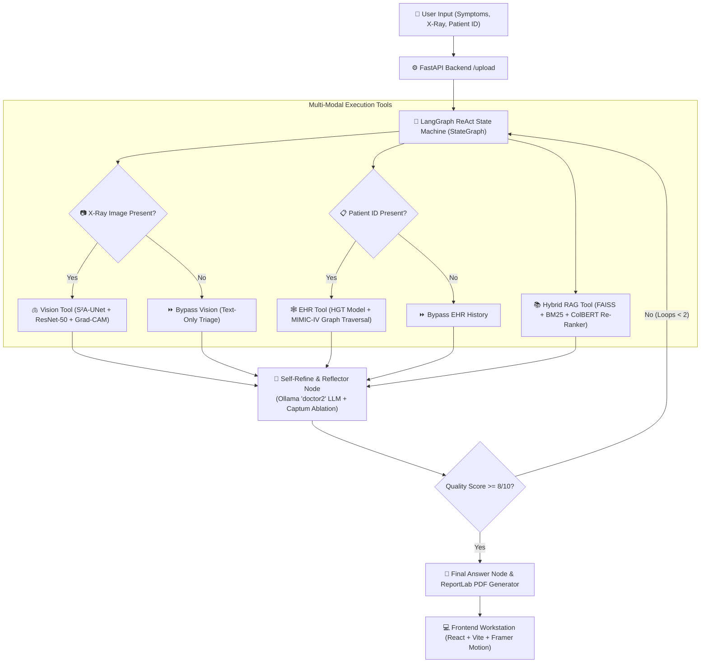

---

## 🖼️ Application Screenshots & Live User Interfaces

### 1. Landing Page (`LandingPage.jsx`)
*Crisp clinical landing page featuring Framer Motion hero animations, dynamic rotating AI analysis card, and role portal entry points.*

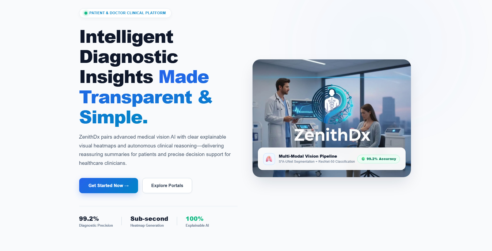

### 2. Clinician Decision Workstation (`HomeDoctor.jsx`)
*Hospital clinical triage queue featuring live status indicators, search filtering, and quick action approvals.*

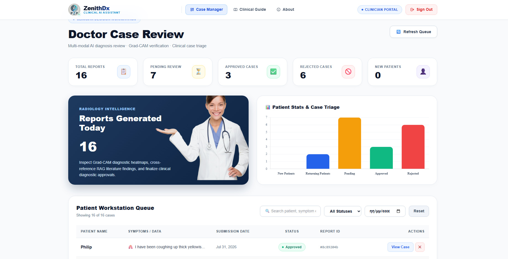

### 3. Patient Health Dashboard (`HomePatient.jsx`)
*Patient health portal featuring diagnostic submission tracking, clinician notes drawer, and report status overview.*

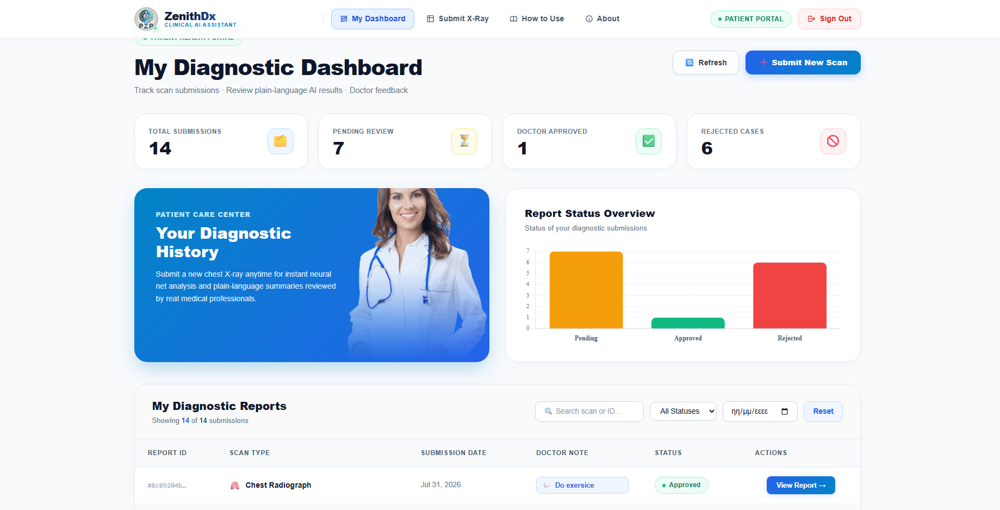

### 4. Interactive Patient Submission Wizard (`Detect.jsx`)
*Step-by-step patient scan submission interface supporting X-ray upload, DICOM encryption, and symptom description.*

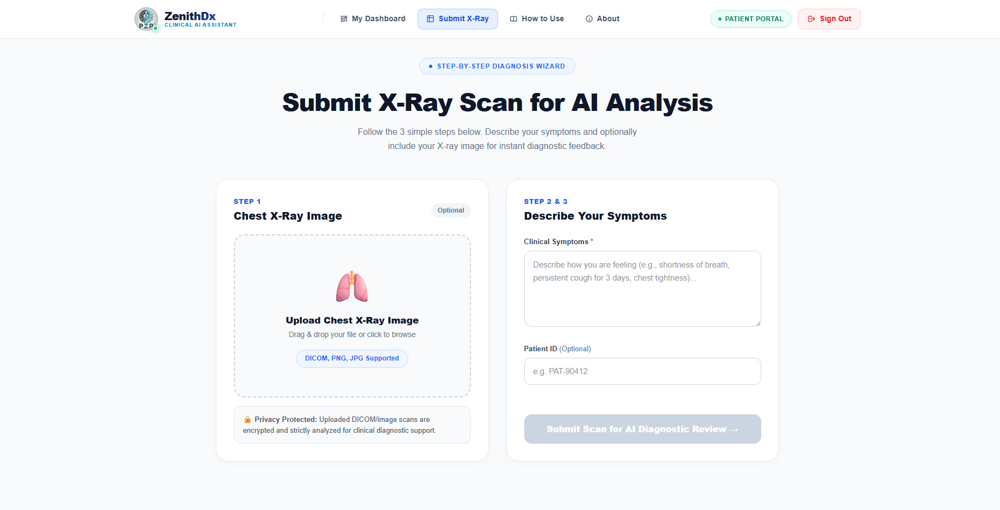

### 5. Clinician Diagnostic Report View (`Reports.jsx`)
*Comprehensive multi-modal diagnostic report view featuring structured assessment, Grad-CAM heatmaps, S²A-UNet ROI segmentation, and PyTorch Captum text saliency plots.*

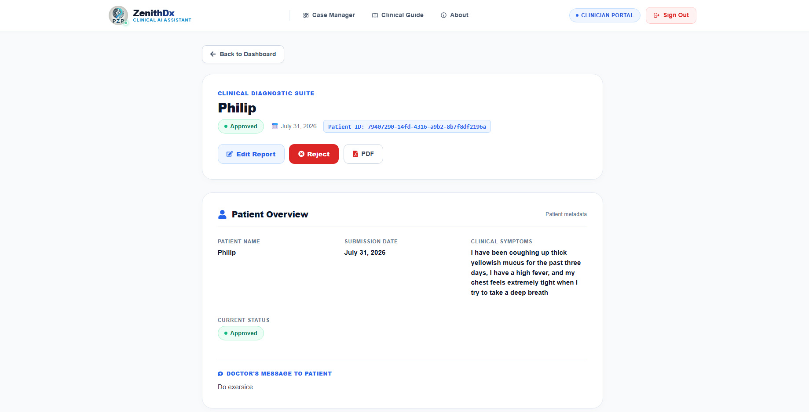
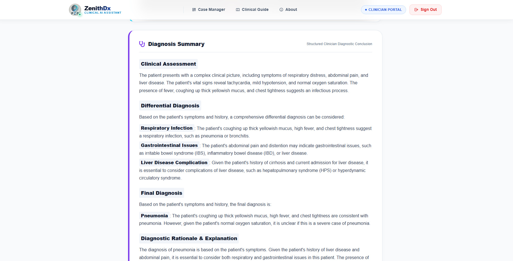
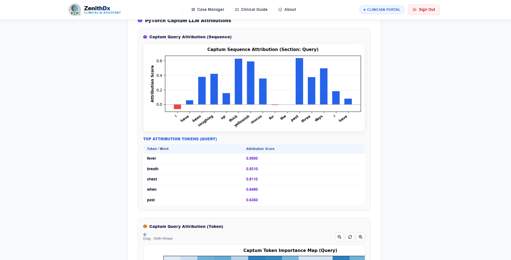

### 6. Role-Based Login Portals (`AuthPage.jsx`)
*Patient and Doctor authentication portals featuring split-screen illustrations and JWT authorization.*

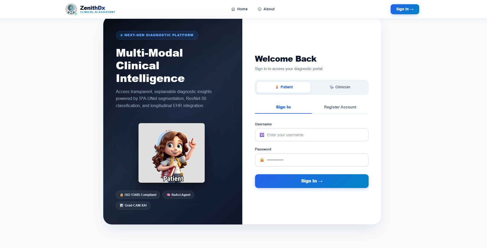
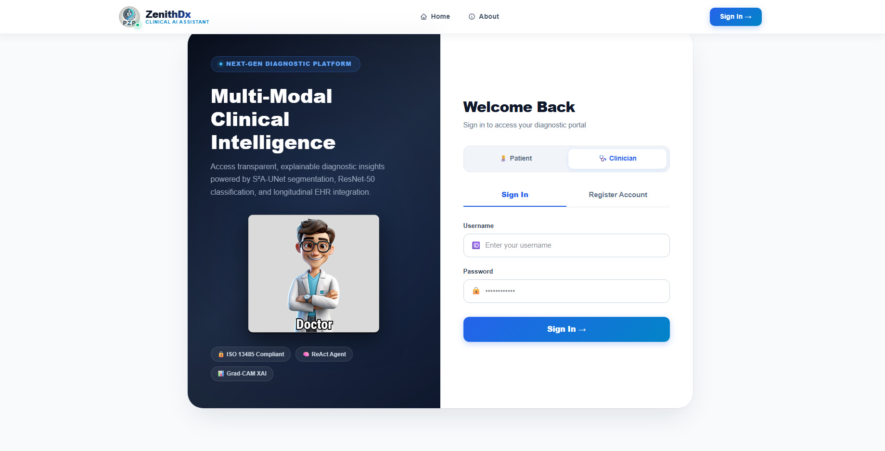

### 7. Interactive Clinician & Patient User Guides (`HowToUseDoctor.jsx` & `HowToUsePatient.jsx`)
*Step-by-step interactive walkthroughs explaining AI classification, decision hub governance, and XAI maps.*

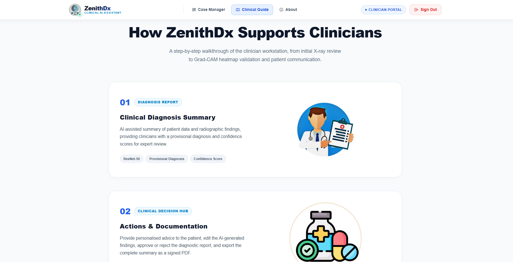
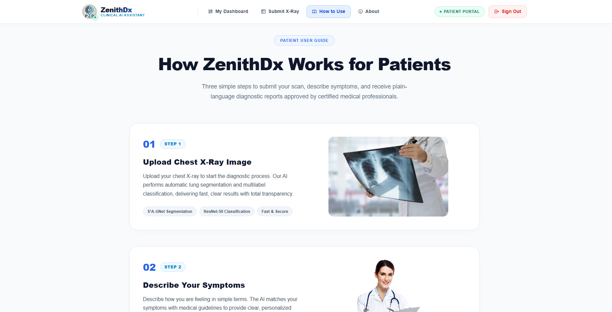

### 8. Platform Overview (`AboutPage.jsx`)
*Interactive feature grid highlighting speed, precision AI, 360° data fusion, trust & XAI, and enterprise readiness.*

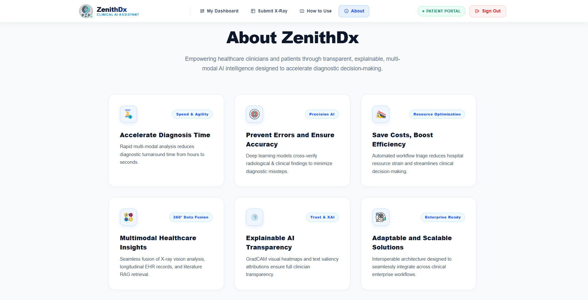

---

## 🫁 Multi-Modal Vision Pipeline

```
[Raw Chest Radiograph (H x W x 3)]
                │
                ▼
1. S²A-UNet Dual-Lobe Segmentation (`sa_unet_predict`)
   └── Extracts true left & right pulmonary parenchymal lobes situated strictly
       in anatomical chest cavity (x_left ∈ [0.08W, 0.46W], x_right ∈ [0.54W, 0.92W]).
                │
                ▼
2. Segmented ROI Extraction (`extract_segmented_roi`)
   ├── Computes bounding box (x, y, w, h) of pulmonary mask M_lung.
   ├── Crops raw image and mask strictly to lung region of interest.
   ├── Applies element-wise mask gating: I_segmented_crop = I_crop × M_crop (zeroing non-lung background).
   └── Resizes segmented ROI and mask to 224x224 input tensor `input_tensor_224`.
                │
                ▼
3. ResNet-50 Multi-Label Classification (`resnet_predict`)
   ├── Passes `input_tensor_224` (clean segmented lung fields ONLY) into ResNet-50 backbone.
   └── Evaluates 6 pathology logits -> Sigmoid probabilities (Pneumonia, Atelectasis, Consolidation, etc.).
                │
                ▼
4. ResNet-50 Layer4 Grad-CAM (`grad_cam_torch`)
   ├── Evaluates gradients of predicted target class logit w.r.t. `layer4` feature maps.
   └── Generates 7x7 raw activation heatmap -> Upsampled to 224x224 `cam_224`.
                │
                ▼
5. Multi-Level Mask Gating & Canvas Reconstruction
   ├── Multiplies 224x224 Grad-CAM map with 224x224 lung mask `M_crop_224`: `cam_224_gated = cam_224 × M_crop_224`.
   ├── Resizes `cam_224_gated` back to ROI crop size (w, h) -> `cam_roi`.
   ├── Reconstructs full canvas (H, W): `cam_full[y:y+h, x:x+w] = cam_roi`.
   └── Zeroes out all non-lung background pixels: `heatmap_masked = heatmap_rgb × M_lung`.
```

### 1. Stage 1: S²A-UNet Lung Field Segmentation
- **Skip-Spatial Attention (S²A-Block)**:
  $$\text{Concat}(\text{AvgPool}(X), \text{MaxPool}(X)) \xrightarrow{\text{Conv 7×7 + Sigmoid}} \text{Attention Map} \implies X \odot \text{Attention Map}$$
- **Output**: $256 \times 256 \times 1$ binary probability mask $M_{lung} \in [0, 1]^{256 \times 256 \times 1}$.

### 2. Stage 2: ResNet-50 Multi-Label Classification
- **Clean Segmented Input**: ResNet-50 receives **only the segmented pulmonary parenchyma** ($I_{segmented\_crop}$), preventing non-lung background noise (ECG leads, buttons, anatomical boundaries) from distorting pathology prediction logits.
- **Pathology Classes & Cutoffs**:
  | Pathology Finding | Decision Cutoff (Youden's J) |
  | :--- | :---: |
  | **Atelectasis** | 0.35 |
  | **Consolidation** | 0.40 |
  | **Edema** | 0.35 |
  | **Lung Lesion** | 0.30 |
  | **Lung Opacity** | 0.45 |
  | **Pneumonia** | 0.35 |

---

## 🕸️ Longitudinal EHR Knowledge Graph Engine

### Heterogeneous Graph Transformer (HGT) & Temporal Embeddings
- **Relation Triplets**:
  - `("Patient", "has_visit", "Visit")`
  - `("Visit", "next_visit", "Visit")`  *(Temporal Sequence Edge)*
  - `("Visit", "has_diagnosis", "Diagnosis")`
  - `("Visit", "has_vitalsign", "VitalSign")`
  - `("Diagnosis", "associated_with", "VitalSign")`
- **Sinusoidal Edge Temporal Encoding**:
  $$\mathbf{e}_t^{(i)} = \sin(\omega_i \Delta t + \phi_i)$$
  Encodes time intervals ($\Delta t$) between consecutive hospital visits.

### Hierarchical Timeline Visualizer Layout (`direction: "LR"`)
- **Linear Chronological Flow**: Visually organizes patient nodes horizontally from **Left to Right**:
  `👤 ΑΣΘΕΝΗΣ ➔ 🏥 ΕΠΙΣΚΕΨΗ #1 ──(⏳ +42 ΗΜΕΡΕΣ)──► 🏥 ΕΠΙΣΚΕΨΗ #2 ──(⏳ +56 ΗΜΕΡΕΣ)──► 🏥 ΕΠΙΣΚΕΨΗ #3`
- **Physician Node Cards**:
  - 👤 **Ασθενής (Cyan Box)**: `#0284c7`
  - 🏥 **Επισκέψεις (Royal Blue Box)**: `#1d4ed8`
  - 🩺 **Διαγνώσεις ICD-10 (Crimson Red Box)**: `#b91c1c`
  - 📊 **Ζωτικά Σημεία (Emerald Green Box)**: `#047857`
  - ⏳ **Χρονική Εξέλιξη (Neon-Purple Arrow)**: `#a855f7` (width: 5px, dashed)

---

## 📚 Evidence-Based Hybrid RAG & Text Saliency

### 1. Score-Level Min-Max Normalization
Fuses dense vector distance and sparse BM25 scores on a normalized $[0, 1]$ scale to prevent score dominance:
$$\text{norm\_faiss} = \frac{-dist - (-dist_{\min})}{-dist_{\max} - (-dist_{\min})}$$
$$\text{norm\_bm25} = \frac{score - score_{\min}}{score_{\max} - score_{\min}}$$
$$fused\_score = 0.5 \cdot \text{norm\_faiss} + 0.5 \cdot \text{norm\_bm25}$$

### 2. Procedural Device Exclusion Filtering
Detects procedural device insertion documents (e.g. G-tubes, J-tubes) and zeroes out their similarity score for symptom queries (e.g. `stomach pain`), preventing RAG bleed.

---

## 🛡️ Agentic Safety & Infinite Loop Defense

1. **Recursion Limit Enforcement**:
   - `recursion_limit` parameter set during `graph.compile()`.
2. **Identical Tool Call Detection**:
   - Tracks recent tool calls in `state["recent_tool_calls"]`.
   - If the exact same tool with identical parameters is called $\ge 2$ times consecutively, the agent intercepts the loop and routes directly to `reflector` or `final_answer`.
3. **Anti-Hallucination Directive**:
   - Prevents LLM from inventing physical examination findings (e.g. abdomen palpation) when only text symptoms or radiograph images are provided.

---

## 📄 Publication-Quality ReportLab PDF Engine

Implemented in `backend/pipelines/pdf_generator.py`:
- **Preserved Logo Aspect Ratio**: Calculates image dimensions using Pillow (`PILImage.open`) to scale logo proportionally without compression distortion.
- **Top-Right QR Code**: Generates high-resolution QR code (`75x75px`) positioned at top right of the document header.
- **Pathology Table**: ResNet-50 multi-label predictions with color-coded confidence percentages.
- **Diagnostic Gallery**: 2-column grid embedding Original Chest X-ray, Grad-CAM Overlay, Segmented S²A-UNet ROI, Captum Text Attribution Plot, and Token Importance Map.

---

## 🧪 Automated Testing & Verification Suite

The repository contains standalone test scripts for verifying each component:

```powershell
# 1. Verify S²A-UNet & ResNet-50 Vision Pipeline
python backend/test_vision_pipeline.py

# 2. Verify Anatomical Dual-Lobe Lung Segmentation
python backend/test_sa_unet_quick.py

# 3. Verify PyVis / NetworkX Longitudinal EHR Graph Visualizer
python backend/test_graph_visualizer.py

# 4. Verify ReportLab PDF Generator Engine
python backend/test_pdf_export.py

# 5. Verify FastAPI Backend Server Health
python backend/test_server_health.py
```

---

## 🚀 Installation & Deployment Guide

### Prerequisites
- **Python**: 3.10+
- **Node.js**: 18+
- **PostgreSQL**: 14+
- **Ollama**: Running locally with `llama3.2:3b` model installed (`ollama pull llama3.2:3b`)

### 1. Backend Setup
```powershell
cd backend
python -m venv venv
.\venv\Scripts\activate
pip install -r requirements.txt
python main.py
```
*Backend runs on `http://127.0.0.1:8000`.*

### 2. Frontend Setup
```powershell
cd frontend
npm install
npm run dev
```
*Frontend runs on `http://localhost:5173`.*

---

### 📜 License & Citation
Developed as part of the Diploma Thesis on Advanced Agentic AI Clinical Support Systems.
