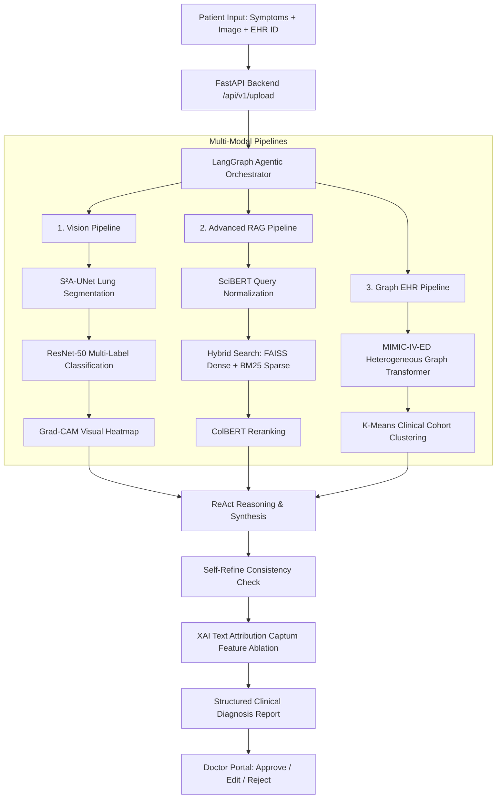

# ZenithDx: Patient-Centric Agentic Clinical Decision Support System (CDSS)

[](LICENSE)
[](https://python.langchain.com/docs/langgraph/)
[](https://fastapi.tiangolo.com/)
[](https://reactjs.org/)
[](https://www.postgresql.org/)
[](https://pytorch.org/)
[](https://ollama.com/)

> **Diploma Thesis Title**: *"Design and Implementation of an Advanced Artificial Intelligence Clinical Decision Support System"*  
> **Platform Name**: **ZenithDx**  
> **Target Environment**: Emergency Departments (ED / Τμήματα Επειγόντων Περιστατικών)

---

## 📋 Table of Contents
- [Overview](#-overview)
- [Key Features & Agentic Architecture](#-key-features--agentic-architecture)
- [Multi-Modal Pipelines](#-multi-modal-pipelines)
  - [1. Computer Vision Pipeline (S²A-UNet + ResNet-50)](#1-computer-vision-pipeline-sa-unet--resnet-50)
  - [2. Advanced NLP & RAG Pipeline (SciBERT + FAISS + BM25 + ColBERT)](#2-advanced-nlp--rag-pipeline-scibert--faiss--bm25--colbert)
  - [3. Longitudinal EHR Graph ML (HGT + MIMIC-IV-ED)](#3-longitudinal-ehr-graph-ml-hgt--mimic-iv-ed)
- [Explainable AI (XAI) Integration](#-explainable-ai-xai-integration)
- [Full-Stack Architecture](#-full-stack-architecture)
- [Clinical Benchmarks & Evaluation Results](#-clinical-benchmarks--evaluation-results)
- [Project Directory Structure](#-project-directory-structure)
- [Installation & Quickstart Guide](#-installation--quickstart-guide)
- [License & Acknowledgments](#-license--acknowledgments)

---

## 🌟 Overview

**ZenithDx** is an open-source, multi-modal, agentic Clinical Decision Support System (CDSS) engineered specifically for high-stress Emergency Department (ED) workflows. Rather than functioning as a passive text generator, ZenithDx operates as an **autonomous medical agent** capable of reasoning, tool execution, self-correction, and synthesizing heterogeneous clinical data—including unstructured patient symptoms, radiological chest X-ray imaging, and longitudinal Electronic Health Records (EHR).

ZenithDx adheres strictly to a **Human-in-the-Loop (HITL)** clinical model: the AI Agent synthesizes multi-source data to generate comprehensive, structured differential diagnosis reports, while attending physicians maintain full control to review, edit, approve, or reject recommendations.

---

## 🧠 Key Features & Agentic Architecture

### 1. ReAct & Self-Refine Agent Loop (LangGraph)
- **Orchestration**: Built on **LangGraph** to model stateful, multi-step agent reasoning.
- **ReAct Paradigm**: Implements Reasoning + Acting cycles to dynamically call specialized analytical tools (Vision, RAG, EHR Graph).
- **Self-Refine Mechanism**: Performs autonomous internal consistency checks and self-critique prior to presenting the final diagnosis to clinicians.

### 2. Fine-Tuned Local LLM Core (Llama 3.2 3B)
- **Cognitive Engine**: Fine-tuned on specialized clinical dialogue and diagnostic datasets.
- **Efficient Fine-Tuning**: Trained using **LoRA (Low-Rank Adaptation)** via **Unsloth** in 4-bit quantization, reducing GPU memory footprint by over 80%.
- **Edge Deployment**: Exported to **GGUF** format for ultra-fast, privacy-preserving local execution via **Ollama**.

---

## 🔀 Multi-Modal Pipelines



### 1. Computer Vision Pipeline (S²A-UNet + ResNet-50)
- **S²A-UNet Segmentation**: A custom-designed Spatial Attention UNet architecture that segments pulmonary regions from chest X-rays with high precision.
- **ResNet-50 Classification**: Multi-label classifier targeting 6 key pulmonary pathologies (Atelectasis, Cardiomegaly, Effusion, Infiltration, Pneumonia, Pneumothorax).

### 2. Advanced NLP & RAG Pipeline (SciBERT + FAISS + BM25 + ColBERT)
- **Clinical Preprocessing**: Medical term lemmatization and normalization using **SciBERT**.
- **Hybrid Dense-Sparse Retrieval**: Merges dense semantic vector search (**FAISS**) with sparse lexical keyword matching (**BM25**).
- **Cross-Encoder Reranking**: Re-ranks top candidate clinical literature snippets using **ColBERT** to optimize context relevance.

### 3. Longitudinal EHR Graph ML (HGT + MIMIC-IV-ED)
- **Heterogeneous Graph Modeling**: Encodes complex patient histories, visit timelines, vitals, and diagnoses from **MIMIC-IV-ED** as a heterogeneous graph.
- **Heterogeneous Graph Transformer (HGT)**: Captures complex temporal and relational clinical dynamics.
- **Cohort Profiling**: Uses **K-Means clustering** over graph embeddings to retrieve relevant past patient visit trajectories.

---

## 🔍 Explainable AI (XAI) Integration

To eliminate "black-box" decisions and foster clinical trust, ZenithDx incorporates dual-mode explainability:

- **Visual Explainability (Grad-CAM)**: Generates spatial activation heatmaps overlaid onto segmented chest X-rays, explicitly highlighting anatomical regions that drove model predictions.
- **Textual Explainability (Captum)**: Employs **Feature Ablation** to measure token-level attribution scores, identifying which symptom keywords (e.g., *fever*, *pleuritic pain*, *dyspnea*) contributed most heavily to the LLM's diagnostic conclusions.

---

## 🛠️ Full-Stack Enterprise Architecture

- **Backend Framework**: Built with **FastAPI** and **Uvicorn** for async high-throughput RESTful APIs.
- **Database & Security**: **PostgreSQL** schema with **OAuth2** and **JWT** token authentication.
- **Frontend Interface**: Developed using **React 18**, **Vite**, and **Tailwind CSS**, offering tailored portals:
  - **Patient Portal**: Seamless submission of symptoms, history IDs, and X-ray images.
  - **Physician Portal**: Comprehensive review workspace with interactive Grad-CAM overlays, XAI attributions, and one-click report editing/approval workflows.

---

## 📊 Clinical Benchmarks & Evaluation Results

| Metric / Benchmark | ZenithDx Score | Baseline / Competitor Models |
| :--- | :--- | :--- |
| **Clinical Diagnostic Accuracy** | **96.28%** | Outperforms general GPT-4 / Claude on structured ED CDSS tasks |
| **Patient Interaction Time (KLM)** | **25.7 seconds** | Streamlined UI submission workflow |
| **Doctor Review Time (KLM)** | **31.9 seconds** | Rapid report validation & approval |
| **System Usability Score (HSUS)** | **76.1 / 100** | Evaluated by **121 practicing physicians** |

---

## 📁 Project Directory Structure

```
ZenithDx_Final/
├── backend/
│   ├── agentic_core/            # LangGraph agent loop, state graph & tools
│   │   ├── agent_loop.py
│   │   ├── graph_state.py
│   │   └── tools/               # Vision, RAG, and EHR tools
│   ├── api/v1/                  # FastAPI routes (Auth, Patient, Doctor)
│   ├── database/                # PostgreSQL connection & migrations
│   ├── pipelines/               # Deep Learning & Graph ML pipelines
│   │   ├── vision/              # S²A-UNet & ResNet-50
│   │   ├── nlp_rag/             # SciBERT, FAISS, BM25 & ColBERT
│   │   └── graph_ehr/           # HGT Graph ML & Clustering
│   ├── xai/                     # Grad-CAM & Captum explainers
│   ├── config.py                # Environment & Pydantic settings
│   ├── main.py                  # FastAPI application entry point
│   └── requirements.txt
├── frontend/                    # React + Vite + Tailwind CSS app
│   ├── src/
│   │   ├── components/          # UI components & XAI heatmaps
│   │   ├── pages/               # Patient & Doctor portal pages
│   │   └── services/            # API integration layer
├── model/                       # Fine-tuned Doctor2 HF model files
├── ollama/                      # Modelfile & GGUF configuration
├── docker-compose.yml           # Full-stack containerization
└── README.md
```

---

## 🚀 Installation & Quickstart Guide

### Prerequisites
- **Python**: 3.10+
- **Node.js**: 18+
- **PostgreSQL**: 15+
- **Ollama**: Installed and running locally ([Download Ollama](https://ollama.com/download))

### 1. Environment Configuration
Copy the `.env.example` file to `.env` inside the `backend/` directory:
```bash
cp backend/.env.example backend/.env
```

### 2. Backend Setup
```bash
cd backend
python -m venv venv
# On Windows:
.\venv\Scripts\activate
# On Linux/macOS:
source venv/bin/activate

pip install -r requirements.txt
python run_migration.py
uvicorn main:app --host 0.0.0.0 --port 8000 --reload
```

### 3. Frontend Setup
```bash
cd frontend
npm install
npm run dev
```

### 4. Ollama Model Import
Import the fine-tuned Doctor2 GGUF model into Ollama:
```bash
cd ollama
ollama create doctor2 -f Modelfile
ollama run doctor2
```

---

## 📄 License & Acknowledgments

This project was developed as part of a Master's / Diploma Thesis in Clinical Artificial Intelligence and Decision Support Systems.

- **Author**: Filippos Z. ([@FilippeZ](https://github.com/FilippeZ))
- **License**: MIT License
