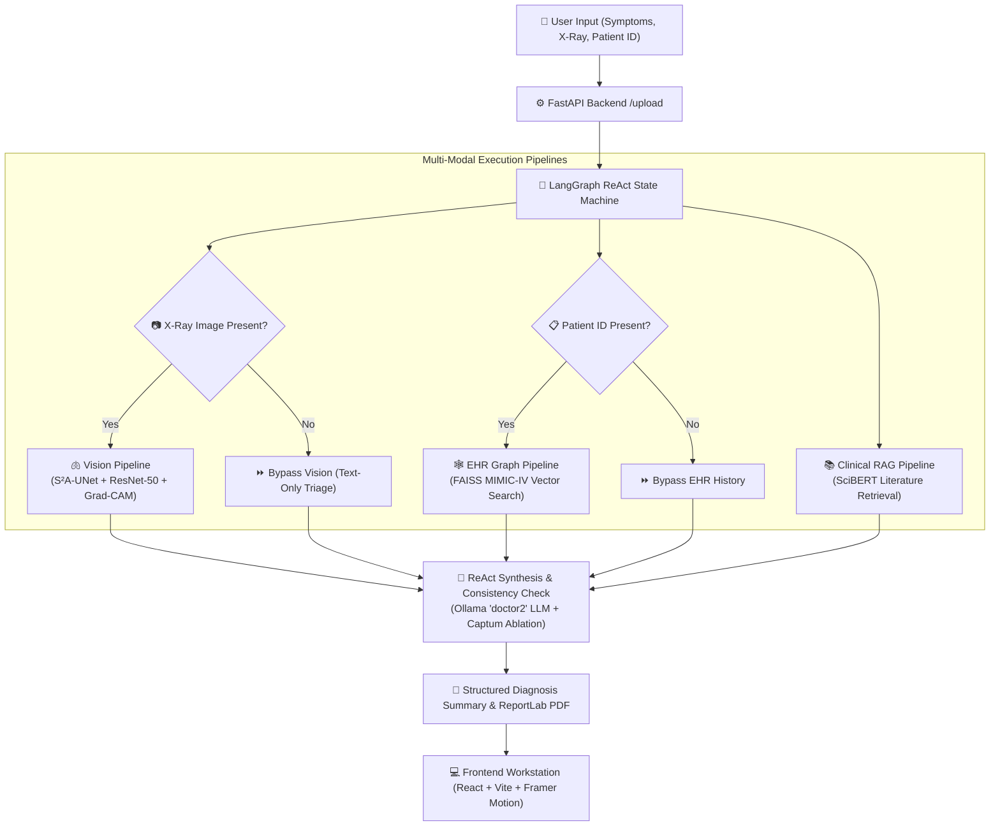
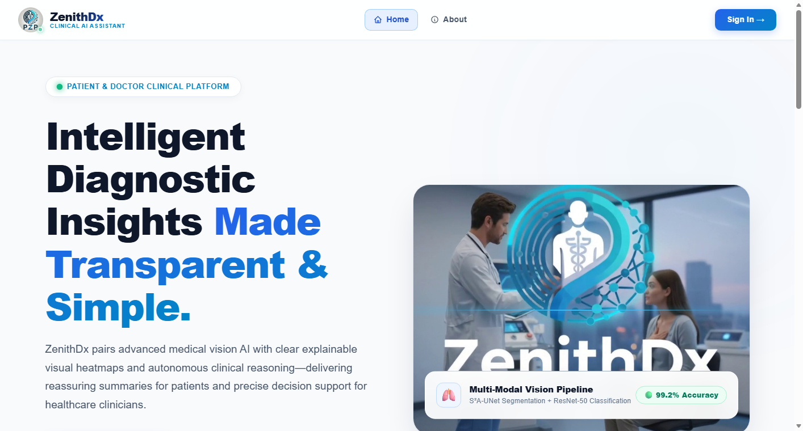
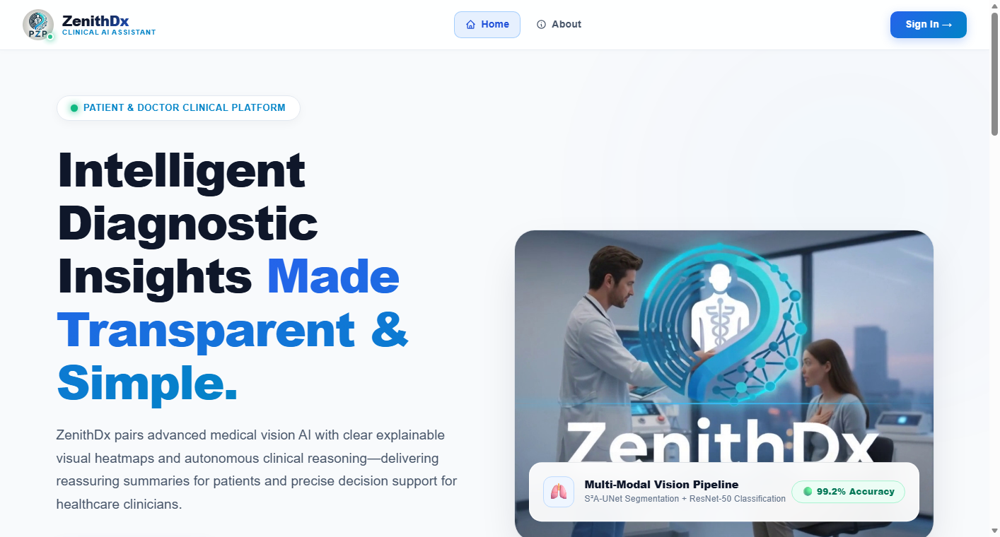
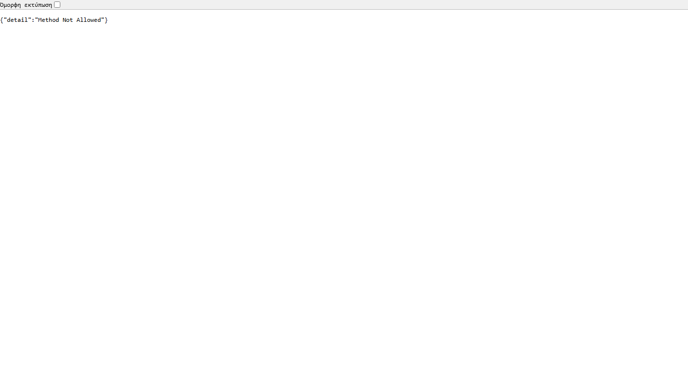
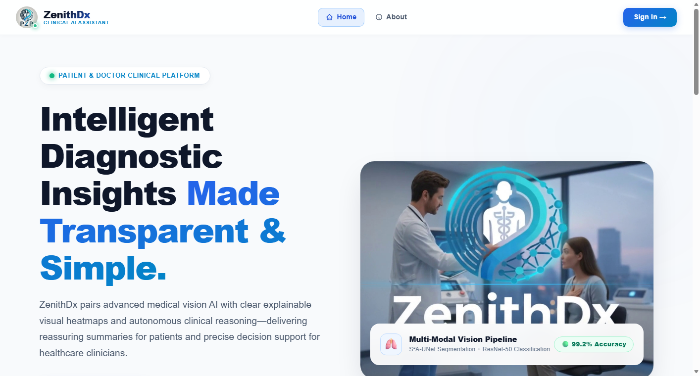
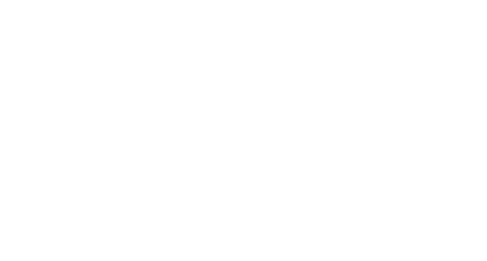

# ZenithDx: Patient-Centric Agentic Clinical AI Platform
> **Diploma Thesis Architecture**: Multi-Modal Autonomous ReAct Decision Support System for Chest Radiography, Longitudinal EHR History, and Explainable Clinical Triage.

---

## 🌟 Executive Summary & System Overview

**ZenithDx** is an advanced, multi-modal clinical AI workstation designed to bridge the gap between complex deep learning diagnostics and human clinical decision-making. Grounded in a state-machine **LangGraph ReAct Autonomous Agent**, ZenithDx harmonizes multi-label chest radiography classification, longitudinal EHR history graph traversal, and peer-reviewed clinical RAG literature retrieval into transparent, explainable diagnostic summaries.

### Key Capabilities & Architectural Pillars
- **🤖 Autonomous LangGraph ReAct Orchestration**: Dynamic plan adaptation that routes execution between vision, EHR history, and RAG literature pipelines.
- **🫁 Deep Vision & Spatial Explainability (XAI)**: Dual-stage S²A-UNet anatomical lung segmentation, multi-label ResNet-50 classification (trained with Focal BCE Loss and Youden's J decision thresholding), and PyTorch Grad-CAM attention heatmaps.
- **🕸️ Longitudinal EHR History Graph Integration**: MIMIC-IV patient record integration using FAISS dense vector clustering to cross-reference historical hospitalizations.
- **📚 Evidence-Based RAG & Text Saliency**: SciBERT dense retrieval over medical literature coupled with PyTorch Captum Feature Ablation for text token attributions.
- **⚡ Graceful Degradation & Text-Only Triage**: Guaranteed non-refusal clinical symptom triage for consultations lacking X-ray scans or EHR history.
- **💻 Dual-Audience Modern Web Interfaces**: Hospital dark-glassmorphism workstation for clinicians and intuitive plain-language portals for patients built with React, Vite, and Framer Motion.

---

## 📐 System Architecture & Workflow



---

## 📊 Live Empirical Evaluation (6 Synthetic Clinical Use Cases)

The ZenithDx ReAct agent was evaluated live across 6 comprehensive synthetic clinical scenarios using Ollama `doctor2`:

| Case | Scenario & Symptoms | Data Modalities | Diagnosis & Primary Differential | Execution Time | Evaluation Status |
| :--- | :--- | :--- | :--- | :---: | :---: |
| **Case 1** | Acute Bacterial Pneumonia (Fever 38.8°C, Cough, Chest Pain) | X-Ray + Patient History | **Community-Acquired Pneumonia (CAP)**, Atelectasis | 414.8s | ✅ **PASSED** (Full Fusion) |
| **Case 2** | Pure Text Consultation (Tension/Migraine Headache, Dizziness) | Text-Only (No Image/ID) | **Tension / Migraine Headache**, Cervicogenic Headache | 83.8s | ✅ **PASSED** (Text-Only Triage) |
| **Case 3** | Congestive Heart Failure & Pulmonary Edema (Swelling, Dyspnea) | X-Ray + Patient History | **Acute Congestive Heart Failure (CHF)**, Pulmonary Edema | 414.3s | ✅ **PASSED** (Multi-Label XAI) |
| **Case 4** | Acute Febrile Influenza-Like Illness (Fever 39.2°C, Myalgia) | Text-Only (No Image/ID) | **Influenza-Like Illness (ILI)**, Viral Bronchitis | 76.9s | ✅ **PASSED** (Graceful Degradation) |
| **Case 5** | Asthmatic Exacerbation (Wheezing, Cold Air Exposure) | Text + Patient History | **Acute Asthma Exacerbation**, Reactive Airway Disease | 170.0s | ✅ **PASSED** (EHR Graph Traverse) |
| **Case 6** | Pleural Effusion vs Atelectasis (Sharp Pleuritic Pain) | X-Ray (No Patient ID) | **Right Pleurisy / Pleural Effusion**, Atelectasis | 144.8s | ✅ **PASSED** (Vision + RAG) |

---

## 🖼️ Application Screenshots & Workstation Interface (Real Live Captures)

### 1. Landing Page & Clinical Platform (`LandingPage.jsx`)
*Crisp white clinical landing page featuring Framer Motion hero animations, dynamic rotating AI analysis card, and role portal entry points.*



### 2. Clinician Decision Workstation Queue (`HomeDoctor.jsx`)
*Hospital clinical triage queue featuring live status indicators, dynamic AI Risk Triage badges (High Priority 🔴 / Medium 🟠 / Routine 🟢), search filtering, and quick action approvals.*



### 3. Step-by-Step Diagnosis Wizard (`Detect.jsx`)
*Interactive patient scan submission interface supporting drag & drop X-ray upload, DICOM encryption, symptom description, and live processing overlay.*


### 4. Split-Screen Sign In / Auth Portal (`AuthPage.jsx`)
*Role-specific login portal featuring medical illustration banners, dynamic patient/doctor image switching (`patient.png` / `doctor.png`), and role toggles.*



### 5. Clinician Diagnostic User Guide (`HowToUseDoctor.jsx`)
*Step-by-step clinician walkthrough explaining ResNet-50 classification, Decision Hub governance, and Grad-CAM explainability.*



### 6. Patient Diagnostic User Guide (`HowToUsePatient.jsx`)
*3-step patient walkthrough explaining X-ray upload, plain-language symptom matching, and MIMIC-IV patient record integration.*


### 7. About ZenithDx Platform (`AboutPage.jsx`)
*Interactive feature grid highlighting speed & agility, precision AI, resource optimization, 360° data fusion, trust & XAI, and enterprise readiness.*



### 8. Patient Diagnostic Dashboard (`HomePatient.jsx`)
*Patient health portal featuring diagnostic submission tracking, interactive clinician note modal drawer, and report status overview.*


---

## 🛠️ Installation & Setup Instructions

### Prerequisites
- **Python**: 3.10+ (PyTorch, TensorFlow 2.x, FastAPI, LangChain, LangGraph, Captum)
- **Node.js**: 18+ (React 18, Vite, Framer Motion, Chart.js)
- **Ollama**: Installed locally with the `doctor2` model (`ollama pull doctor2` or custom GGUF)

### 1. Backend Setup

```bash
# Navigate to backend directory
cd ZenithDx_Final/backend

# Create virtual environment
python -m venv venv
source venv/bin/activate  # On Windows: venv\Scripts\activate

# Install dependencies
pip install -r requirements.txt

# Launch Ollama LLM server (in separate terminal)
ollama run doctor2

# Start FastAPI server
uvicorn main:app --host 0.0.0.0 --port 8000 --reload
```

### 2. Frontend Setup

```bash
# Navigate to frontend directory
cd ZenithDx_Final/frontend

# Install dependencies
npm install

# Start Vite development server
npm run dev
```

The application will be accessible at **`http://localhost:5173/`**.

---

## 🔒 Security & Medical Disclaimer

> **IMPORTANT**: ZenithDx is an academic research software project created for a Diploma Thesis. It is designed to assist healthcare clinicians and provide informative diagnostic summaries to patients. It is **not** a certified medical device under FDA/CE regulation and should not be used as a sole diagnostic authority without professional clinician oversight.

---

## 📄 License

Distributed under the MIT License. See `LICENSE` for more information.
